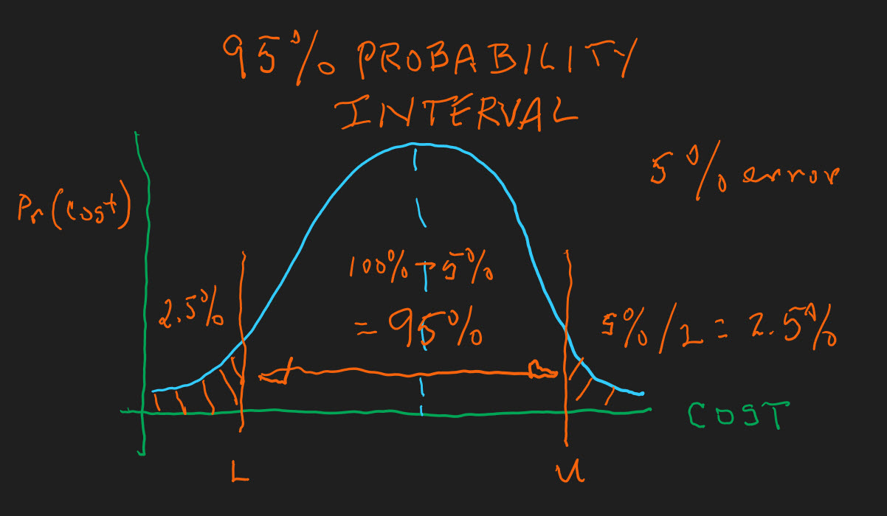
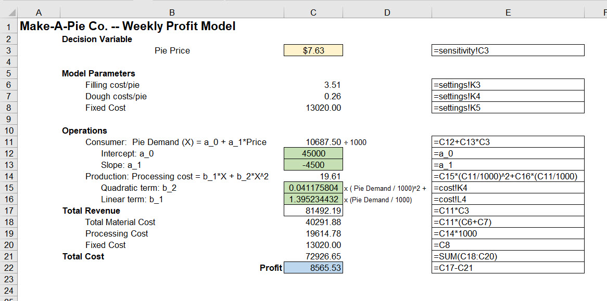
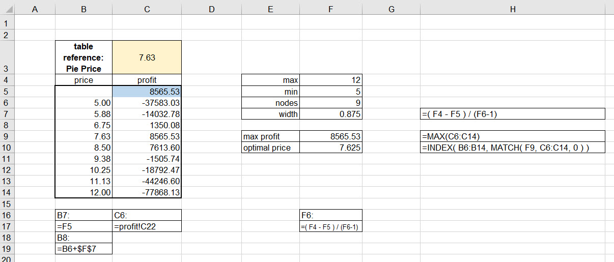
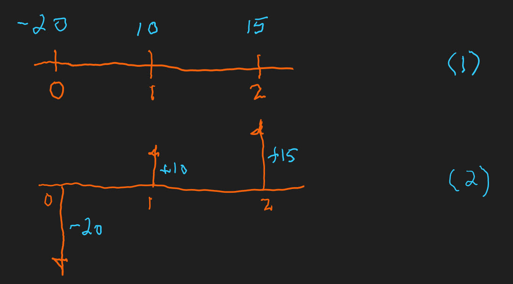
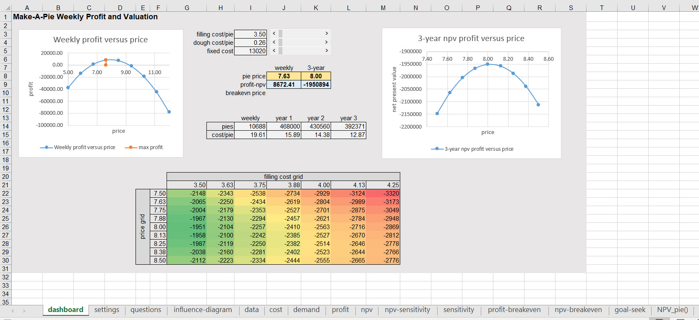

```{r setup, include=FALSE}
knitr::opts_chunk$set(echo = TRUE)
```

## How many?

According to the [Irish Technology Review and quoting Microsoft](https://irishtechnews.ie/seven-reasons-why-excel-is-still-used-by-half-a-billion-people-worldwide/?__cf_chl_jschl_tk__=eae1fe306ae27d3c9013b3704732878b80fc40f3-1616828018-0-AT1moxdZF6mKZLmtRhwzMYiVaKyU0bEe2Kz5ftdXTKKKtNdWjF6EH2e2blKxl4oVSpuFZbzH-mNHukGtzFU29btUpDwqUKJvi9xyIjQO2DmcXQ5OgccXl-AuKvdAhk9DltuuYjjrNzeh4fVzX8UvaT5nwAEAgONZ3H3GSh31P4tILL2x5OQsLXC2YFwcpthCsLENuLjGg0zZErvhaeOTbXpwVuKHBHPkZV5sZEq0wRZS6dIlxtzhO-g07UukzOtBi6GlAF_ctySgFuZ0yOwH7cFr8CzWiAUsP_GHqca5nOzJ-rbPuRMi9oc60Cb7cs7XlwM5cpxrwszbftEeCzYOV3QYkxFFKt8coSEzj5fetcnep_Fh7kEyR7xtuS5cXK_mZs8f8OkanlEyk7HesLVi0KxvIEmxk4XG1qZz8gH0DFdXYhQ2oFcLXdh4G-8gKYcwaDuvC4Ykkn2ybSU-sfazfgMLzKKIzAYgw-4r_gYvo2XG) over 750 million users enjoy (?) Excel. I am enamored of points 3 and 4. I first ran into Excel with [Martha Grabowski at LeMoyne College]() in 1989. I _enjoyed_ Lotus 1-2-3, used Visicalc, and Supercalc since 1981. I was not yet convinced about Excel. I learned C by building a very stripped down version of Borland's Quattro Pro with the idea of building option pricing models from finance directly into the DNA of the spreadsheet. We already knew that spreadsheets would inhabit if not infect the earth. My first balk was the use of the Excel _=_ instead of the $@$ of Lotus formulae. Easy to overcome, but still the $@$ (shift-2) is in my fingers' muscle memory. 

I say all of this because we will see many changes in the expression of technology over the life cycle called our careers. Prepare Ye For The Changes To Come! I have experienced a lot of software products (not an expert at all and mostly a dilittante!) from very simple machine language to assembler to FORTRAN (with IMSL, LINPACK, EISPACK) to APL, APL2 (data shaping on steroids!), PLI and SAS, very early stage Matlab on DOS, S, S-Plus, LISP, PROLOG, BASIC, VBA (skipped Visual Basic interface with Oracle!), JavaScript (also skipped Java), C, C++, now R, Python, and, my almost favorite, Julia. Anything that works! Among all of these, spreadsheet products seem to have passed muster and kept going strong for the past 4 decades.

I must mention separately, [Arthur Whitney's kx, A+ and Shakti](https://www.efinancialcareers.co.uk/news/2019/11/shakti-arthur-whitney) as the RISC (reduce instruction set computing) version, and maximizing time series vectors with relational databases and SQL (think vectoring FORTRAN). This is in the avant-garde of analytics. What a list of developments over the past several decades that lead us to the mixmaster and symbiosis of technology, technique, and skills we call analytics.

[APL2](https://www.ibm.com/products/apl2) taught me data shaping. Whatever heuristics and algorithms within algorithms we devise in Excel are completely influenced by the shaping capabilities of array-driven technology like APL2, whether overtly or covertly. Unfortunately for a mathematically and numerically challenged population of analysts, APL2 is about to be deprecated. Yes a historically interesting, but practical issue exists? And yes, again, it does. we will develop analytically-based and at least influenced career paths that are really modeling with data paths. Musa Jafar keeps saying that there is a a 10-15 year cycle of software hegemony. I agree. The issue for us analysts is to develop capacities, not just skills in specific environments, which are agnostic to software platforms. In computing jargon, our minds must be interoperable across the platforms that enable us to inject data and interpretable analysis into our analytical products for consumption by decision makers.

Enough for this bully pulpit! The key take-away, so to say, is that we must begin with mind, go to data, and end up with mind. The mind has the thinking faculties that dicate what data is or is not important, credible, useful to the mind's view of the next horizon. 


## What's new?

Simone Tortiere liked the model but furrowed her brow. Supply costs are sky-rocketing and customer demand is flagging. She is thinking about refinancing, perhaps even selling the business to a company with more capital resources. In fact she is in contact with a ;Special Purpose Acquisition Company (SPAC).](https://www.investopedia.com/terms/s/spac.asp) Top of mind for her is three year plan. But first she wants to traverse the demand and cost terrain she might face. At risk is her \$2.5 million investment. She asks us to help her to revisit the pricing decision in this context.

### The costs they are a-changing

Make-A-Pie is experiencing much more volatile changes in its processing costs. These represent everything from capital (think ovens) to labor (think bakers) and supporting infrastructure (think fixed costs here though). Here is a revised schedule of processing cost against volumes in thousands of pies produced in an average (actually a median) week.


The previous schedule appears for comparison purposes. All of this calls for a new estimation of the way cost varies with pies demanded, and sold. So far storage is not an issue, yet.


There is a new kid in this block of numbers. Columns F and G calculate lower $L$ and upper $U$ 95\% probability interval bounds. Make-a-Pie's policy is not to tolerate any more than 5\% errors in any given week. This rendering helps to explain the policy.



We might observe costs distributed symmetrically about a proposed future, or even actual, value. If the distribution is Gaussian, also known as normal (though there is nothing that normal about it!), then we can use Excel to calculate the lower and upper bounds of cost using the number of standard deviations $z$ from the model mean of costs we estimated and the standard error of the model $s_e$.

$$
\begin{align}
L &= \mu - |z_{0.025}|s_e \\
U &= \mu + |z_{0.975}|s_e
\end{align}
$$

For some mean $\mu$ and standard deviation $\sigma$ of observed outcomes $X$ we can first first find the deviations of the outcome from the mean, $X-\mu$. Then we can calculate the number of deviations per standard deviation $\sigma$.

$$
z = \frac{X-\mu}{\sigma}
$$

We use Excel's NORM.INV() to calculate the $z$ values with a mean of 0 and standard deviation of 1 at lower bound 2,5\% cumulative probability and upper bound 97.5\% cumulative probability. This produces the 97.5 - 2.5 = 95\% probability interval. All $z$ distributions have this standard mean and standard deviation. That is very convenient.[^winston-normal]

[^winston-normal]: @Winston2019 Chapter 69 is a good and very basic introduction to random variables and Chapter 72 is a decent brief on the normal (Gaussian) distribution and z scores. We might skip ahead to Chapter 74 where he discusses the use of probability in making forecasting statements.

Of course some errors, we might call them, are intolerable, such as breaches of legal requirements and non-compliance with regulations such as food handling. The bounds are calculated around each actual, as opposed to predicted, processing costs. A picture is much in order.


There is a wide enough variation to cause further identification and assessment of root causes and potential failure modes in the operation.

### Demand takes a step back

Make-a_Pie customers buy the pies from grocery stores. Tortiere plans to set up a program with restaurants and schools as well. But we will wait for that later. Suffice it to say, such a plan will garner increased regulatory scrutiny anda requirements, all the more so-called overhead.

Recent store surveys reveal that there will be no demand for prices above \$10, but demand increases by about 4,500 pies per week for each dollar price decrease below \$10.  For example, at a price of \$8 Make-A-Pie could expect demand of 9,000 pies. Here are the calculations.


The new conditions yield lower than previously thought volume intercept and steeper slope to meet the zero demand price of \$10. Consumers are definitely feeling the pinch in their household budgets. Grocery stores, responsible for handling, storage and insurance have increased their markups as well. 

### A new profit dawning

All of this yields a new weekly profit calculation and sensitivity analysis.



Cells drive in from source worksheets. Notably the C3 price comes from the price sensitivity analysis worksheet. 



With these settings, Tortiere smiles at the weekly profit. But she knows full well this is not the whole story.

## An algebra of pie

The rest of the story boils down to the relationships among variables of interest to Tortiere. She faces increased supplier costs and volatility of costs and consumer preferences. She believes her business is going under. Decisions, pricing, resources, timing, investment, must agily respond. She hunkers down with us, her analytical trusted advisors, to understand the breadth and depth of the situation. 

### A little lite algebra

First, she likes the influence diagram. Second, she wants to extend the ideas in the diagram across three years. She thinks this is a reasonable planning period. It can roll forward to future three year intervals. In her experience, three years is a cycle in her industry: feeding the hungry. The influence diagram generates this algebraic model of key relationships.

$$
\begin{align}
price_i       &= price_{set}  (1 + price_g) ^ {i - 1} \\
demand_i      &= (a_0 + a_1  price_i) * 52 \\
revenue_i     &= price_i  demand_i \\
process_i     &= (b_1  (demand_i / 52000) + b_2  (demand_i / 52000) ^ 2) (52)(1000) \\ 
doughcost_i   &= dough_0 demand_i  (1 + dough_g) ^ i \\
fillingcost_i &= filling_0  demand_i  (1 + filling_g) ^ i \\
fixedcost_i   &= fixed_0  (1 + fixed_g) ^ i \\
cost_i        &= process_i + doughcost_i + fillingcost_i + fixedcost_i \\
profit_i      &= revenue_i - cost_i \\
pv_i          &= profit_i + pv_{i+1} / (1 + rate) ^ 1
\end{align}
$$

The insight here is that the set price, $price_{set}$, gets the ball rolling. When chosen, price feeds demand, which, in turn, drops into the determination of processing cost, filling and dough costs as well. Total revenue is price times demand. Total cost is the sum of all component costs. Profit is revenue minus cost. All of these elements are tracked from year $i= 1 \ldots T$. In our case Make-a-Pie has a $T=3$ year horizon. 

Several variables grow across this horizon. If we set price in year $i = 1$ to $price_{set}= price_1 = 9.00$ and grow the price at $price_g = 0.02$ per year, then by end of year $i=2$ $price_2$ is

$$
\begin{align}
price_2 &= price_1 (1+price_g)^{2-1} \\ 
        &= price_1 (1+price_g)^{1}   \\
        &= 9.00 (1 + 0.02)^1 \\
        &= (9.00)(1.02) \\
        &= `r 9*1.02`
\end{align}
$$

In contrast we set $filling_0 = 3.50$, at $i = 0$, with growth rate $filling_g = 0.07$ the initial 3.50 would grow to $3.50(1+0.07)^1 = `r 3.50*1.02^1`$ by the end of year $i=1$. This amount will compound to $3.50(1+0.07)(1+0.07) = 3.50(1+0.07)^2 = `r 3.50*1.07^2`$ by the end of year $i=2$. And as they often say in Leipzig _und so weider_, and so on with the other calculations subject to growth rates.

### PV's last stand

THe last equation builds, even better, accumulates value from one yeat to another. Here is a simple example for a two period cash flow process. We can extend it to any number of forward periods. We can also think of periods as seconds, minutes, days, weeks, months, quarters, years, decades, centuries, and we get the idea! We conceive of getting or giving out cash flows (profits? losses?) right now, date 0, next period, as of date 1, and the following period, as of date 2.

This drawing depicts the process.



Panel (1) depicts three cash flows, -20, 10, and 15 occurring at the end of each periods with dates 0, 1, adn 2. Panel (2) uses directional arrows to animate the conversation a bit. These directional arrows are frequently used in financial engineering applications and are part of the influence diagram tool-kit.

The next panel displays the calculation of the more or less obvious result that the present value of -20 paid out today is just that, -20.


We notice the discounting mechanism at work here. We calculate $-20/(1+0.10)^0$ and realize that anything raised to the zero power is just 1 and a thing times 1 is just the thing itself. Very philosophical.

This next panel shows a calculation of the present value of a cash flow in one period. In fact this is the kernal of all discrete cash flow present value calculations. It is all we need to know for any number of cash flows. Here it is.


We discount 10 by 10\% as $10/(1+0.10)^1$ to get 9.09. The _N.B_ (that is, note well) comment works the process in the other direction. Post 9.09 bail at date 0 and receive 10\% return of 0.91 and the return of principal of 9.09 to get 10.00 at the end of the next period at date 1. Discounting and growth are inverse processes.

The next, and thank goodness, last panel shows that all we need is the one period present value. The tally so far includes present values of -20 and 9.09. One more plank to walk down and we are done. 


A cashflow occurring at the end of two periods at date 2 is first discounted at 10\% to date 1 for a date 1 value of 13.64. Then, and if all goes well (and the creek doesn't rise!), 13.64 discounts to 12.40, again at 10\%. The PV tallies to 1.49. This is, finally, and forever more in our minds, **net present value** (NPV). NPV is just the present value of all cashflows, including today's cash flow.

Now we can add one more equation to the mix.

$$
pv_i =  cf_i + \frac{pv_{i+1}}{(1+r_{i, 1+1})^1}
$$

Any date $i$ present value equals the cash flow occurring in date $i$ plus the discounted present value at the next date $i+1$ at a rate of return that is expected to occur from date $i$ to date $i+1$. This is powerful medicine for multi-period planning models. We will come back to this when we attempt to optimize a multi-period pricing structure for Simone Tortiere in the not so distant future.

### The model in the mist

We will let this picture of the multi-period model begin to speak for itself (so to spreak).


Two things we should notice. First, the model simply is a the profit model with growth in filling, dough, and fixed costs, and let's not forget, a first year price that grows (or we can let decline). The algebraic representation maps directly into the formulae on the right. Also the price for the profit model can be set manually or comes from the sensitivity analysis worksheet.

Second, the calculation of discounted profits (really cash flow, we will have to consult with the accountants here), happens in two steps. We first calculate the discounted profit for each year. Then, second, we sum up all of the present values of cash flows (oops, profit) to arrive at the multi-period profit (cashflow) criterion we called net present value in cell C27. We do not use Excel's NPV() function for expositional reasons (showing off the full calculation) and to eliminate any confusion about the calculation.[^winston-npv]

[^winston-npv]: @Winston2019 Chapter 8 has many interesting details about the NPV() (and also the IRR()) functions in Excel. But if we calculate the =NPV(H26, C26:F26) we get the wrong answer, about -1,840,000. This is because Excel considers the first cash flow to occur in the first period and thus discounts the first flow by the discount rate, here 10\%. Many have done this, and some have paid the price of operational error. So why not call the NPV function the PV function? Someone at Microsoft did this a long time ago but for cash flows of even amounts, sometimes called an annuity. 

### How sensitive?

The model computes profit sensitivity again. Here is the setup to refresh our memories of days past.


The Data > What if > Data Table feature comes to our aid again. We use INDEX-MATCH to locate the profit maximizing price. We plot the results for human consumers of the analysis. Here is the setup for the plot. 


We locate the plot in the dashboard worksheet. This is familiar to us from the last time we met the model with only weekly profits.


Done.

Well, not done. What about NPV? We perform the same tasks as we did for profit maximizing price. We use a data table to create the for loop of replacing prices in the npv worksheet with prices from the data table, and for each price calculate a new NPV. Here is the table.


Of course we want to plot it. Plotting produces one more bit of information than the table: it makes very explicity the non-linear shape of profits, and multiperiod profits here labeled net present value.


Oh, and one more thing, this plot dramatically shows that Make-a-Pie is under water, a quaint trope that more than suggests a uniformly, across the range of prices and for three years, a loss in the value of the enterprise. Simone Tortiere definitely furrows her brow over this rendering.What to do next?

### One way or the other

We now venture into the world of a 2-way sensitivity analysis.[^winston-2-way] We brace ourselves and strap in. First, of course, we set up a grid. This time two are two lists, here for price, and also for a variable of interest, filling cost per unit. Second, we make a grid and supply the reference for the npv calculation (from a separate npv-sensitivity worksheet to avoid possible calculation conflicts, oh my!). The references for the price and filling cost per unit on in the same worksheet as the data table. The npv sensitivity(2) worksheet does the calculations for the 2-way sensitivity table.

[^winston-2-way]: @Winston2019 Chapter 17 shows us how to construct one-way and two-way data tables in good detail. We must always be sure to have data table reference cells in the same worksheet as the data table. In Chapter 93 he performs a many-way data table. This is a technique that easily lends itself to a spider-plot. [Microsoft Office help has this to say about 2-way data tables.](https://docs.microsoft.com/en-us/office/troubleshoot/excel/create-two-input-data-tables)

We call up Data > Table > What if, the row-column dialogue box appears. We choose price for the row and filling cost per unit for the column.


We press OK and see this table.


This took 5 seconds to run. That's too slow for a production model as we are often a bit impatient for results when under the track referee's gun to start the race! One way around this is to create our own  model in Visual Basic for Applications. Here is a picture of such a model in the Developer ribbon. 


The user-defined function (UDF) is NPV_pie. It calculates the same value as the npv worksheet and is a good quality control check on what turns out to be a fairly complex model. The VBA function employs a FOR-NEXT loop. When we build grids like price and filling cost per unit we are implicitly using a for loop structure. We have an initial value like the minimum price. We then in the next cell increment the previous cell's value and then move to the next cell until there are no more cells to go to.[^for-loop-unix]

[^for-loop-unix]: The logical thinking behind the spreadsheet seems more like the do-done logic in macro-assembler languages that underly Excel, VBA, C++, FORTRAN, APL2. [Here is an IBM reference for examples.](https://www.ibm.com/support/knowledgecenter/en/SSLTBW_2.1.0/com.ibm.zos.v2r1.bpxa400/bpxug193.htm) Cell by cell calculations also seem analogous to the addresses in processor memory registers. [Here is an example for x86 Intel processors.](https://www.cs.virginia.edu/~evans/cs216/guides/x86.html)

Here is an illustration how we can use a function, or for that matter any formula, in a two way table (simply two inputs to the formula or the function). Suppose that we have the normal distribution describe cost behavior. We propose several values of the mean $\mu$ and standard deviation $\sigma$. We want to relate a mean with a standard deviation as if a scenario, just like a price and filling cost per unit combination. The formula for the Gaussian (normal) distribution is this beast.

$$
Pr( x \mid \mu, \, \sigma) = \frac {1}{\sigma {\sqrt {2\pi }}}e^{-{\frac {1}{2}}\left({\frac {x-\mu }{\sigma }}\right)^{2}}
$$

where $d$ is some sort of data we are considering, say, $d = 9$. We ask this question: **How plausible is it to observe a price that is \$9.00 per pie when when the mean and standard deviation are different values, and, this is crucial, we believe that price observations in general follow a Gaussian (normal) distribution?**

A data table comes to mind, of course! We set up $\mu$ and $\sigma$ grids, reference this beast of a formula, copy and paste into cells in Excel's memory caches, for example, like this rendering.


Instead of the Gaussian beast, we could have used the Excel NORM.DIST() function (with the last parameter set to FALSE for the probability mass calculation for which we clamor.) And instead of that we use our own, bespoke, NPV_pie() function. 


And oh yes we selected the table results and at the Home > Conditional Formatting button selected Color Scales > Green-Yellow-Red. We have the notorious heat map. Use of heat maps for performance and heat map discussions are notorious because some believe them to be misleading and not good practice, [as in this article by Osama Salah.](https://www.fairinstitute.org/blog/heat-maps-dont-support-iso-31000) He references the [risk management international standard ISO 31000](https://www.iso.org/iso-31000-risk-management.html) for support. We can, and should, have some debate over this topic. 


## Lo and behold yet again

This is what we have been waiting for, agina. We modified the modular nature of this spreadsheet application extensively. The dashboard worksheet interacts with all but the questions worksheet, at least in this iteration of the application. All Simone Tortiere needs to do, after paying our invoice, is to put the cursor on the slide bars that help her understand how the profit maximizing price changes with changes in the unit and fixed cost assumptions.[^winston-slidebars]

[^winston-slidebars]: @Winston2019 Chapter 27 has a discussion on the implementation of user form controls. These are located on the Developer ribbon at the Insert button. [Here are directions to show this ribbon in your workbook.](https://support.microsoft.com/en-us/topic/show-the-developer-tab-e1192344-5e56-4d45-931b-e5fd9bea2d45)



Is there too much in this dashboard, a question we shouldl ask Simone Tortiere? Are the colors of the heat map misleading? Only if they do not lead to a rational discussion of the lack of value in the organization, based on all of the assumptions of this analysis.

What price is best? All we have to do is live with whatever assummptions we make and read the dashboard. Using this and our beliefs about the credibility and plausibility of our results we ponder further. If enough political and emotional capital are present for a change, then change we must. 

A break-even price is not even possible in this environment. If we went back to high school and solved the equation quadratic in prices that is the net present value equation we would get complex number solutions. Why? Because the NPV iceberg is entirely under water, it is negative. We would have to do something much more radical like change the structures behind the assumptions to float NPV back up to more solar energy.

## References and endnotes

