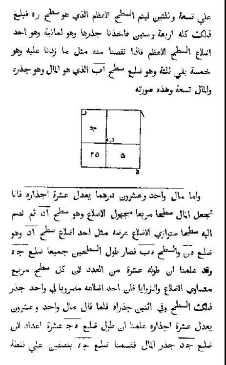
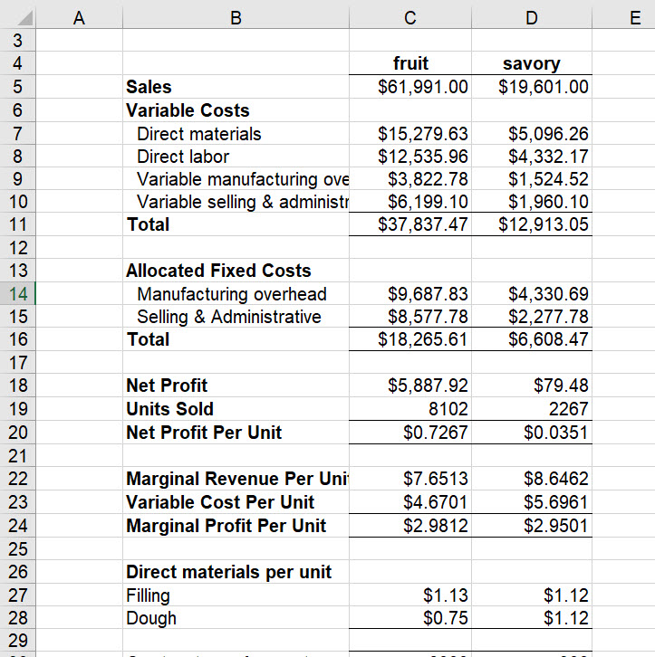
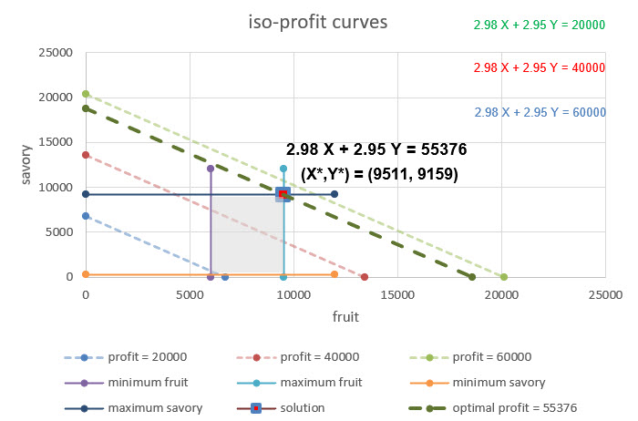
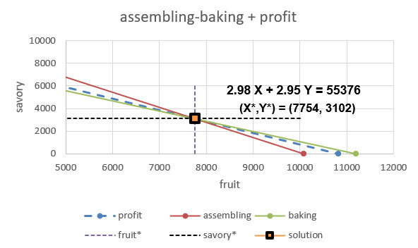
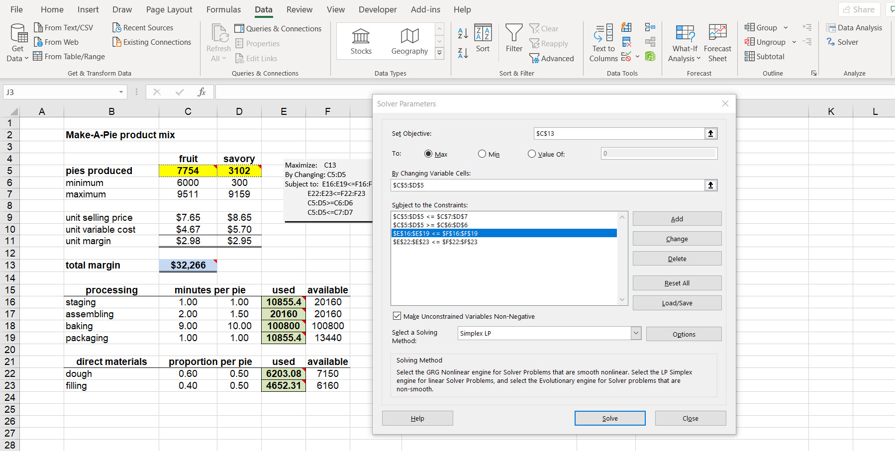

<script>
function showText(y) {
    var x = document.getElementById(y);
    if (x.style.display === "none") {
        x.style.display = "block";
    } else {
        x.style.display = "none";
    }
}
</script>

```{r include=FALSE}
knitr::opts_chunk$set(echo = FALSE, message = FALSE, warning = FALSE)
options(digits = 3, scipen = 9999)
library(visNetwork)
library(tidyverse)
library(kableExtra)
```


## It all started here

The first centuries of Islam saw the confluence of Hindu, Persian, and Mesopotamian science and mathematics. It is the algorithms that concern us here. The Latinized (translated, that is) name of Persian mathematician Muḥammad ibn Mūsā al-Khwārizmī (Persian: محمد بن موسی خوارزمی, romanized: Moḥammad ben Musā Khwārazmi; 780 – 850 CE) is _Algorithmi_- from the Arabicized al-Khwarizmi and formerly Latinized as Algorithmi. He led the research and teaching programs at Baghdad's _Beit-al-Hikima_, the House of Wisdom.

Central to our purposes, Al-Khwarizmi wrote and compiled a procedure in _The Compendious Book on Calculation by Completion and Balancing_, 813–833 CE (@AlKarizmi830) which we still use today to systematically solve linear and quadratic equations. We come across both in our work: net present value and profit both are quadratic in price, or volume. He employed both _reduction_ and _balancing_ (whatever we do to one side of the equation be must do on the other side). The algorithms we use to solve for optimal decisions depend explicitly on the procedures developed and taught, As did al-Khwarizmi, we too will use algebra and the geometrical representation of equations to describe, explain, and interpret our results.



This page from al-Khwarizmi's work describes his procedure to find the largest square of 8, and of course it is 64. We will use equations, drawings, and graphs to perform much the same tasks for this menagerie of models.

- allocation models

- covering models

- blending models

- network models

As we should always, we begin with a simple, but instructive, and even useful model for a decision maker.

## From humble beginnings

Allocation modela choose mixes and compositions typically of competing decisions to optimize an objective (often some sort of cash flow or profit) subject to less-than or equal to constraints on capacity and availability of a resource. Examples include product and sales mix, vendor mix, and team member compositions. Resource constraints often dictate a trade off among alternatives.

Make-A-Pie (MAP) produces two kinds of pies: savory and fruit. Each product requires some labor in procurement of ingredients, assembly of pies, and baking. MAP sells pies through a local distributor as well as by contract to grocery store chains. These marketing channels estimate maximum potential sales for each product in the coming quarter. The MAP accounting department calculates profit contributions for each product. The decis **ion problem is to determine the product mix which maximize MAP"s profit for the quarter by choosing production quantities for the savory and fruit pies. 

We ask three questions.

1. **What are we deciding?** We need to set product mix. These are the volume of pies to be produced. There will be many possible, feasible alternatives from which to choose. For MAP the decisions are just the number of savory pies and number of fruit pies.

2. **What is success?** We next define a performance criteria against which we measure the impact of our decision alternatives. In many organizations, the criterion is profit, or net cash flow, or net present value of benefits, costs, and risks to performance. At the least we will need to know the contribution of decisions to profit. To that end we ask the management accountants to render profit per pie. This number when multiplied by the decision number of pies will yield the total profit of the decision alternative. We are not yet done. Our criterion is **maximize profit**. 

3. **How is success constrained?** First of all, the decision variable themselves may have minimums and maximums. Contracting with grocery chains may require minimum volumes of on-time and in-full delivery of pies to maintain the marketing channel. Second, each process will have only so many hours of operation in a given week. The time frame of a week, of the limitations of work force, materials, and even square footage of floor space to produce all present themselves as candidates to constrain the feasible combinations of fruit and savory pie production volumes. Then there is potential demand which requires a number of fruit and savory pies.

We have additional information from Tortiere and her CFO Marta Fazi. Adhering to good spreadsheet engineering practices we store this first report in a separate worksheet called `margin`.



Marta believes that the savory line of pies is very unprofitable from a pure accounting model of value. However, she knows that allocated fixed costs must be incurred given a capacity to produce a range of the volume of pies. These expenses include environmental, health, and safety costs, general maintenance of equipment and work spaces, and even long-term employee benefits. Thus, she produced a marginal revenue, variable cost, and materials report.

We work with Marta to develop a further understanding of the business. We ask about the production process, its sub-processes, resource requirements per pie per pie line, and the availability of resources. Critical to this understanding is the way the decisions to produce pies winds its way into the underlying production processes and material availability.


Marta likes the documentation using FORMULATEXT() as she trains, and educates, analysts to think through the work flow. We agree that the minutes it takes to procure, assemble, bake, and package pies is a unit of productivity measure of importance. Labor is key to the operation. The available labor minutes by activity constrains the production of pies. Adhering to good spreadsheet engineering practices we store the report in a separate worksheet called `availability`. Labor minutes of availability across pie lines is infuenced by the full time equivalent work force, number of shifts (maximum of 3 8 hour shifts), number of days (7 in a week), minutes in a day run through hours. 

We model material availability through inventory. We start with beginning of the week inventory at the end of the previous week. During the week we procure ingredients thus adding to the beginning of week inventory. Then we start to use the ingredients in some proportion that is possibly different for each pie line. At the end of the week we tally up additions and subtractions to arrive at the end of week inventory. We then define material availability as beginning of week inventory plus additions to inventory procured during the week, but in advance of a production run in any shift.

### 1. Decisions, decisions

We attend to our first question, first. **What are we deciding?** We know we need to set the product mix. These are the volume of pies to be produced. There will be many possible, feasible alternatives from which to choose. For MAP the decisions are just the number of savory pies and number of fruit pies.

Here is a 2 dimension mapping of the decision space of all volumes of fruit and savory pies.


First, we notice that we define decisions only in the positive quadrant of all possible combinations of fruit $X$ and savory $Y$ pies. Both decisions are continuous on the positive real number plane.

$$
\begin{align}
X &\geq 0 \\
Y &\geq 0
\end{align}
$$

Not only this constraint, but we also observe that there are minimum and maximum boundaries for the decisions.

$$
\begin{align}
6000 \leq \, &X \leq 9511 \\	
300 \,\,\leq \,\,  &Y \leq 9159
\end{align}
$$

Both a graph and and algebraic expression help us describe the decision space of possiblities.

### 2. Resources they are a'constraining

Perhaps borrowing too liberally from the Bob Dylan verse, we proceed to the second modeling question **What is success?** We now work with Marta and her MAP analysts to define a performance criteria against which we can measure the impact of our decision alternatives. In many organizations, the criterion is profit, or net cash flow, or net present value of benefits, costs, and risks to performance. In general this measure is multi-faceted for example when removing snow in Montreal PQ, there are competing objectives of cost and environmental impact minimization (@Labelle2002). 

At the least we will need to know the contribution of decisions to profit. To that end we review Marta's profit per pie report. These marginal profits when multiplied by the decision number of pies will yield the total profit of the decision alternative. We are not yet done. Our criterion is then to **maximize profit**. 

This graph depicts the family of equal-profits combinations of $X=$ fruit pie volume and $Y=$ savory pie volume, known affectionately as **iso-profit** curves. We can compactly express these curves using this equation.

$$
\begin{align}
aX + bY = c
\end{align}
$$

We already know what $X$ and $Y$ are. Coefficient $a$ is the profit contribution per unit of decision $X$ units (fruit pies!). Coefficient $c$ is the profit contribution per unit of decision $Y$ units (savory pies!). These add up to $c$ total profits. 

For example if we produce $X=10$ fruit pies and $Y=5$ savory prices, _and_ $a=\$2.00$ marginal profit per fruit pie produced and sold and $b=\$3.00$ marginal profit per savory pie produced and sold, then we can compute total profit $c$.

$$
\begin{align}
aX + bY &= c \\
(2.00)(10) + (3.00)(5) &= c \\
20 + 15 &= c \\
35 = c
\end{align}
$$

Yes, it is as simple as this. The hard thing we had to do was come up with the right decisions and the marginal profits. We will use this formulation throughout our modeling work flow. We will also produce plots that will depend on the solution of $Y$, on the vertical axis, the ordinate, in terms of $X$ on the horizontal axis, the abscissa, of the plot. In homage to al-Khwarizmi, we balance and reduce terms to arrive at the solution.

$$
\begin{align}
aX + bY &= c \\
aX - aX + bY &= c - aX \\
0 + bY &= c - aX \\
bY &= c - aX \\
\frac{bY}{b} &= \frac{c - aX}{b} \\
(1)Y &= \frac{1}{b}(c - aX) \\
(1)Y &= \frac{c}{b} - \left(\frac{a}{b}\right)X \\
Y &= \frac{c}{b} - \left(\frac{a}{b}\right)X
\end{align}
$$

Where we used the algebraic facts that $aX - aX=0$, $b/b = 1$, and the distributive property of multiplication over addition. The term $c/b$ is the intercept and the term $-(a/b)$ is the slope of the straight-line (often called linear) equation of decision $Y$ in terms of decision $X$. In all of its glorious detail.

After all of that algebra in all of its glorious detail, we deserve to see our handiwork.


 
We parameterize the iso-profit curves with three levels of profits, \$20,000, \$40,000, and \$60,000, color coordinating the equations and the dashed iso-profit lines. An increase in profits shifts the iso-profit lines to the right. Not only that, but increased profits require, of course, more sales and production of pies. The slopes of each of the iso-profit curves are the same. This means they are parallel to one another, they cannot ever cross in this slice of the decision universe. 

We can measure the profit tradeoff between savory and fruit pies directly through the slope. While we might have avoided calculus in our analytics journey, or perhaps not encountered it officially at all, we can use it to think through the marginal profit tradeoff. We start with the total change in profit $dc = a\, dX + b\, dY$, that is the sum of the change in profit due to a change in volume of fruit pies, $a\, dX$, and the change in profit due to a change in volume of savory pies, $b\, dY$. 

These are lovely mathematical and linear operators at work. Without the fuss of knowing exactly what all that entails, but because they are linear (and by the way smooth) operators, we can solve for the ratio of $dY/dX$, the vauntedY profit tradeoff, when, and this is key, the change in profit is stable, that is, 0, $dc=0$.

$$
\begin{align}
dc &= a\, dX + b\, dY \\
0 - a\, dX &= a\, dX + b\, dY - a\, dX \\
- a\, dX &= b\, dY \\
\frac{dY}{dX} &= -\frac{a}{b}
\end{align}
$$

In our case $a = 2.98$ and $b = 2.95$. The two pie lines are literally neck-to-neck. The tradeoff is evidenced in the negative slope. A (very small) increase in fruit pie volumes **reduces** profit by $2.98 / 2.95 = `r 2.98 / 2.95`$, just a bit over a dollar.  This tradeoff is the same for any level of profit, thus the $dc=0$ assumption. Phew!

Let's overlay the minimum and maximum decision contraints on the iso-profit curves to get some perspective and maybe another insight or two.


The low profit regime (\$20,000) just seems to makes it into the feasible rectangle of minimum and maximum pie requirements. The high profit regime (\$60,000) does not at all. The **decision core** will be somewhere within the feasible rectangle. One such profit is a mid profit regime of (\$40,000). Is this the optimal profit? Not yet! By shifting the iso-profit lines we must see that there is one (1) optimal, that is, maximizing profit, fruit and savory volumes solution. This plot depicts the situation.



That's right, the maximizing profit decision is to produce and sell the maximum number of fruit and savory pies. This yields a profit of \$55,378. We simply moved the high profit regime line to the left to land on the northeast vertex (also known as a corner) of the four-sided polytope (also known here as a variant called a rectangle) that describes the region of feasible decision combinations. Again PHEW!
 
### 3. Not without constraint

We reach our third modeling question **how is success constrained?** First of all, the decision variable themselves may have minimums and maximums. Contracting with grocery chains may require minimum volumes of on-time and in-full delivery of pies to maintain the marketing channel. We know that this is sufficient to get at a notion of an optimized objective. 

Second, each of the procuring, assembling, baking, and packaging processes will have only so many posible hours of operation in a given week. The strict time frame of a minute, an hour, a day, a week, of the limitations of work force, materials, and even square footage of floor space to produce all present themselves as candidates to constrain the feasible combinations of fruit and savory pie production volumes. Then there is potential demand which requires a number of fruit and savory pies. Even here markets, competition, communication create further constraints.

Again, we attempt an algebraic description. For the decided upon volume of $X=$ of fruit pies and $Y$ of savory pies, we have four (4) process resource constraints.

$$
\begin{align}
staging:\, &X + Y \leq 20160 \\
assembling:\, &2 X + 1.5 Y \leq 20160 \\
baking:\, &9 X + 10 Y \leq 100800 \\
packaging:\, &X + Y \leq 13440 
\end{align}
$$

$$
\begin{align}
filling:\, &0.6 X + 0.5 Y \leq 7150 \\
dough:\, &0.4 X + 0.5 Y \leq 6160 
\end{align}
$$
With the same results we developed for profit curves, we can find intercepts and slopes and plot these relationships. Here are the constraints for the four processes. We leave out the profit relationship for now.


We seek only the most constraining of these curves. We immediately see that both staging and packaging outstrip the assembling and baking processes. To the left of the assembling and backing process constraints lies a potential set of feasible decisions. Also we note that the slopes of the staging and packaging process constraints are the same. This adds to their irrelevance and redundancy. It is not that they are unimportant. Not at all, just not helpful in identifying the region within which decisions can be found feasibly. By feasible we then mean the decision space that fits all of the constraints. This criterion is then met only by the most constraining of the processes here.

And here are two ingredients for the material group of constraints.


They intersect at around $X=$ 5,000 fruit pies and $Y=$ a little under 9,000 savory pies. To the left of the kinked boundary at this point we may, just maybe, an optimal decision.

We now put the material constraints together with the relevant assembling and baking constraints.


Wow, both of the material constraints are cut away by just the assembling and baking process constraints. Those two are the most constraining of the suite of six constraints. They alone define, along with the demand constraints, the feasible set of decisions.


That point at which the assembling and baking processes lies well within the minimum and maximum boundaries of the demand requirements. We arrive at the feasible decision space. Just one more step will get us to our goal of maximizing profit with pies!

### Let us eat pie

And produce and sell it. Our sponsor Simone Tortiere and colleague Marta Fazi have followed us through this intense analysis. We are now ready to uncover the answers which we seek in this case. Here is the the final overlay of an iso-profit line through the intersection of the assembling and baking constraints.



The iso-profit line registers a maximizing profit of \$55,376 against optimal 7,764 fruit and 3,102 savory pies. How can be know this is the best choice? First, any pie decision greater than this will be infeasible, will not honor the assembling and baking process constraints. Second, any iso-profit to the right of the dashed line will surrely be at a greater profit but then will evoke decisions that are infeasible. Any iso-profit to the left will enlist feasible decisions, but will be less profitable than the profit at the dashed line. We have found an optimizing solution, the hard way!

## An easier way?

We can use the algebra of al-Khwarizmi to solve consecutively, much like the process we just followed, by eliminating, balancing, reducing constraints until we get to that one, or two, or three, or more feasible decision points. At those points we can move in the direction of increasing profit, moving the iso-profit curve to match the feasible decision point, all very geometric, in an algebraic sort of way. George @Dantzig1949b developed such an algorithm, the Simplex algorithm of linear programming.[^dantzig-abstract]

[^dantzig-abstract]: Here is the abstract. "Activities (or production processes) are considered as building blocks out of which a technology is constructed. Postulates are developed by which activities may be combined. The main part of the paper is concerned with the discrete type model and the use of a linear maximization function for finding the 'optimum' program. The mathematical problem associated with this approach is developed first in general notation and then in terms of a dynamic system of equations expressed in matrix notation. Typical problems from the fields of inter-industry relations, transportation nutrition, warehouse storage, and air transport are given in the last section."

We use the Solver add-in from Excel to help us solve this problem algebraicly. We check that Excel has enabled the [Solver add-in using the instructions at this site.](https://support.microsoft.com/en-us/office/load-the-solver-add-in-in-excel-612926fc-d53b-46b4-872c-e24772f078ca#:~:text=Load%20the%20Solver%20Add-in%20in%20Excel.%201%20In,the%20Analysis%20group%20on%20the%20Data%20tab.%20) There are instructions for Windows, Mac-OS, and other operating systems. We find the Solver add-in in the Analysis group in the Data ribbon (way to the right!). Frontline Systems gives us [this tutorial for using the Solver add-in, replete with examples and spreadsheets.](https://www.solver.com/tutorials)

We set up a separate worksheet for our decision optimization. Here is the setup.


We color decisions yellow, criteria blue, and constraint usage green. Extensively SUMPRODUCT comes to our aid. We see the technology of pie making through the process and material constraints. The proportions of material filling and dough and the processing of the materials into pies evoke the design of each pie. We express labor and capital supply and demand, customer supply and demand through costs, availability, capacity values and constraints. This worksheet refers to other worksheets like availability and margin for values from reports and analysis.

We are ready to use Solver.



Let's look at one of the constraints, actually all four of the processing constraints. Here is how we enter and edit a constraint.


Constraint arrays can be chosen without the need to put each constraint separately. Thus the way we set up the problem with constraints in rows together, decisions in columns together, allow us this succinct way to implement the model. We press OK and go back to the main Solver dialogue. If we think we have loaded all of the data into Solver, we then press Solve.


This dialogue asks if we want to use the new solution. If yes, this will wipe out the previous solution. We also can write other reports to worksheets. Sensitivity analysis is one such report we will need. Press OK to see the solution deposited into our model.

All of this is very mechanical. Our design of worksheets definitely has that character. But design is born of principles and practice. These spreadsheets follow the logic of the algebraic model. The model and its inputs in turn follow the scope of Tortiere's and Fazi's requests, born of the need to understand the technology, markets, and competition in the markets all around pie making and feeding others.[^winston-solver-lp] 

[^winston-solver-lp]: We can visit @Winston2019 for several of the tricks up his sleevers. Chapter 29 is an introduction. He follows this with chapters 30-35 for various examples of linear programming of many business problems. Other chapters in his book reveal further examples. 


