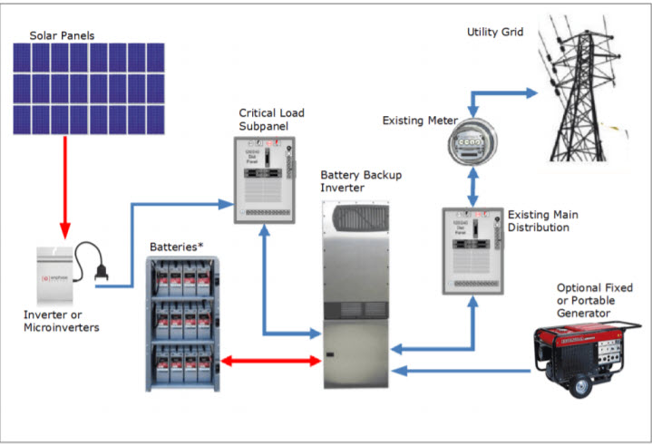

# Case: Salmerón Solar Systems LLC

## Photovoltaic systems

With 50 packaged small scale photovoltaic systems already leased to industrial operators, Toni Salmerón would like to offer her US based solar leasing company for sale at a price of \$1,000,000 before the beginning of next year's operations. Tomi and her partners have built up the business over the past five years using their savings and good old-fashioned sweat equity. They hold key patents on battery, control, and manufacturing technology that they intend to retain. Toni wants us to develop a three-year economic analysis to evaluate buyers' tenders for the company. 

## The particulars

The company's property taxes are \$35,000 per year and are expected to grow at an annual rate of 4\%. Toni currently spends \$4,800 per year per system to maintain and administer the fleet. Administrative and maintenance costs are expected to increase by 7\% per year.

Currently, Toni leases her systems for \$1,000 per month each. She leases 60\% of the systems each month. Toni believes demand for her systems is highly elastic. Her market surveys and pricing experiments indicate that the percentage of the fleet leased each month increases by 7\% for each \$100 per system per month reduction in the lease price. For example, at \$600 per month, she expects that 88\% of her systems would be rented. She also believes lease prices can be increased 9\% in years two and three without affecting the fleet lease percentage established during the first year.

At the end of three years, Toni assumes for the purpose of the assessment that the buyer will resell the business for three times the revenue earned in year three. Until the end of the third year, the fleet size will remain constant so that no systems will be bought or sold.

## Some definitions are in order

Toni defines cash flow simply as revenue minus expenses, and for this assessment will ignore depreciation and income taxes. After all, that is on the buyer in any case. She assumes that cash flow in year three includes the proceeds from the sale of the business at the end of the year and that year one's cash flow does not include the purchase price as this transaction will have happened prior to the first year in the analysis. She also defines overall investment profit as the net present value of the cash flows over the forecast horizon, assuming a discount rate of 10\%.

## Requirements

1. We construct an influence diagram for our analysis, labeling the decision variables, the key parameters, and the performance measures.

2. We then use the influence diagram diagram to construct an Excel spreadsheet. We label the cells containing the key problem parameters and constants. Our design and implementation uses named ranges, and no hard coding of constants anywhere.

3. We use a data table to determine the system lease price that achieves the highest overall investment performance. A graph builds on our ability to communicate results.

4. We then construct a 2-way data table to analyze the sensitivity of overall investment profitibility to at least one of following parameters: purchase price, annual maintenance cost/system, annual property taxes, and/or lease price growth rate.

5. We deposit results in a dashboard to summarize and focus a discussion around this organization/s value.

