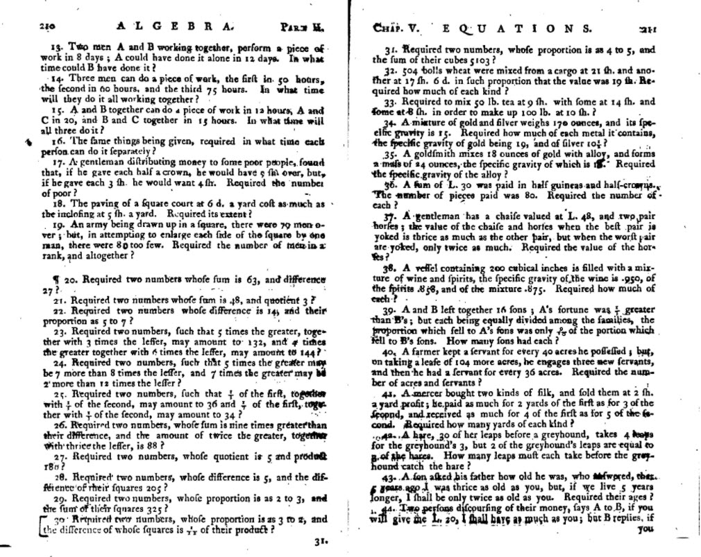
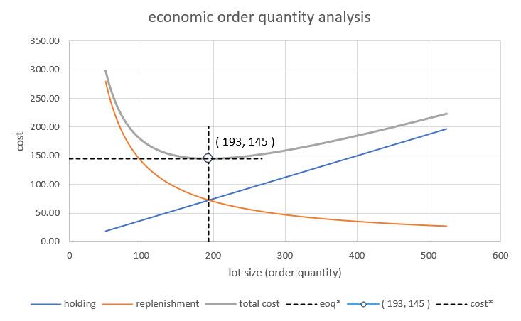
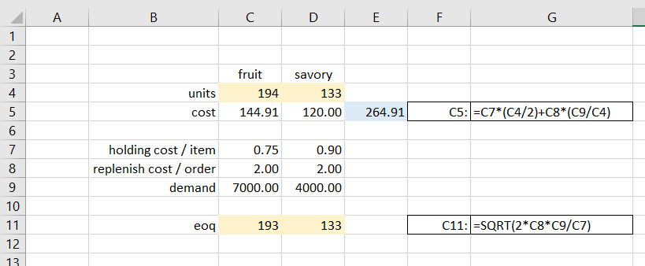
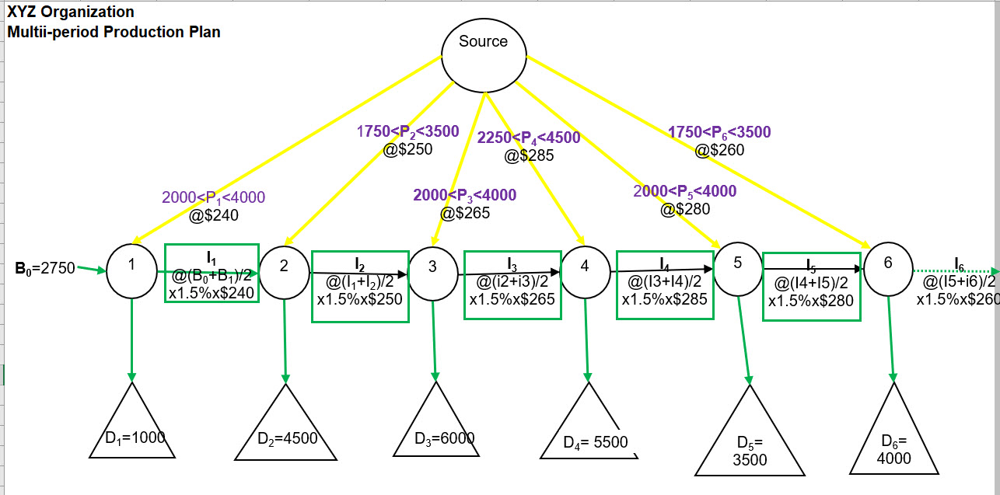
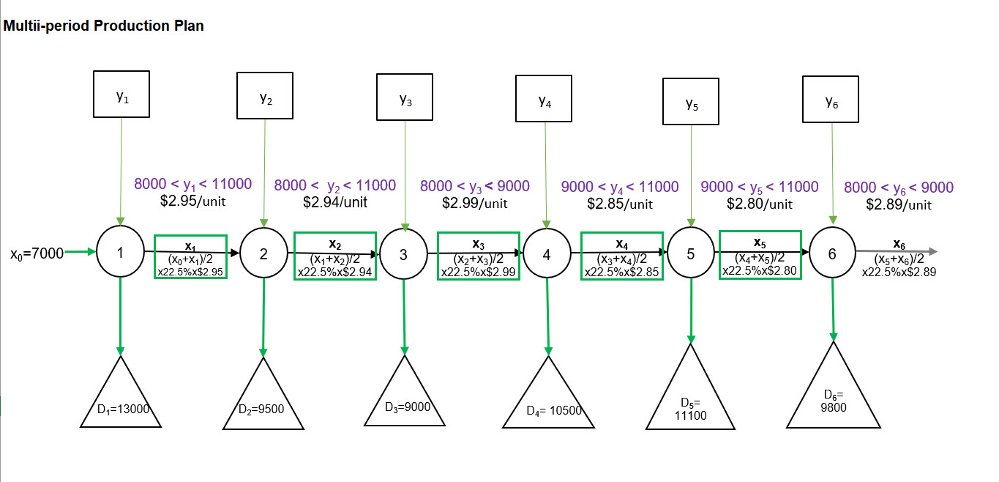

# Expanding horizons

<script>
function showText(y) {
    var x = document.getElementById(y);
    if (x.style.display === "none") {
        x.style.display = "block";
    } else {
        x.style.display = "none";
    }
}
</script>

```{r include=FALSE}
knitr::opts_chunk$set(echo = FALSE, message = FALSE, warning = FALSE)
options(digits = 3, scipen = 9999)
library(visNetwork)
library(tidyverse)
library(kableExtra)
```


## Dido's bullhide


Queen Dido fled the tyrannical ruler of Tyre to found the city of Carthage. Rome later razed it to the ground, salted the earth, and to this day, the site in Tunisia is inarable. Virgil at about 21-19 BCE regaled the ruling class of Rome with its origin story, that of Aeneas, Greek veteran of the Trojan War. Aeneas landed at Carthage and into Dido's arms. Star-crossed lovers were not blessed by gods or humans, all ending in tragedy for Dido and Carthage, eventually, and the establishment of Rome by myth.

Wonderful story, but here is a formal optimization problem solved by Dido which resulted in her, and her retinue, founding of Carthage. They solved the problem of finding the figure bounded by a line which has the maximum area for a given perimeter. The solution is a semicircle. Here is a statement of the problem in Virgil's Aeneid, of course, with an engaging back story up front to keep up at the end of our seats.

"The Kingdom you see is Carthage, the Tyrians, the town of Agenor;
But the country around is Libya, no folk to meet in war.
Dido, who left the city of Tyre to escape her brother,
Rules here--a long and labyrinthine tale of wrong
Is hers, but I will touch on its salient points in order....Dido, in great disquiet, organised her friends for escape.
They met together, all those who harshly hated the tyrant
Or keenly feared him: they seized some ships which chanced to be ready...
They came to this spot, where to-day you can behold the mighty
Battlements and the rising citadel of New Carthage,
And purchased a site, which was named 'Bull's Hide' after the bargain
By which they should get as much land as they could enclose with a bull's hide."

Well, we suppose they took the largest bull they could find and produced the longest length of leather thong they could and enclosed land area within the semicircle of leather lacing. Well, that's an optimization problem, solved! 

Around 300 BCE Euclid wonders about the minimal distance between a point a line, and proves that a square has the greatest area among the rectangles with given total length of edges. About 100 BCE Heron proves that light travels between two points through the path with shortest length when reflecting from a mirror. This last optimization had psychological and metaphysical implications since the reigning theory from Plato was that light emanates from our souls outward into the world and what we see is what is reflected back to us.
 
Here we go this time with part two (ni in Japanese this time).  In mathematical
finance, the idea of maximising a profit is, of course, very important, but it's modulated by the need to simultaneously manage the risk of loss. This all boils down to a sophisticated version of the very everyday idea of not putting all your eggs in one basket, also known as diversification.

Cervantes wrote _Don Quixote_ in the 1600s. Here's a useful quote. 

"It is the part of a wise man to keep himself today for tomorrow and not venture all his eggs in one basket." 

Not only is diversification involved here, but also the beginnings of the notion of delayed consumption. The idea is that we might need to save for the future. Inventory is a sort of delayed consumption as well. Cervantes almost gets it. Another quote from Shakespeare expands on Cervantes (although backward in time!) the more sophisticated idea. In the Merchant of Venice, Shakespeare cleverly diversifies the asset structure of a whole estate, the portfolio, across time, when Antonio, in a conversation with his friends, told his friends he wasn't spending sleepless nights worrying over his commodity investments, and he says: 

"My ventures are not in one bottom trusted, nor to one place, nor is my whole estate upon the fortune of this present year, therefore my merchandise makes me not sad."

Hidden in there is this idea of thinking about having a balance between the near future and the rather more distant future in terms of the return on a portfolio of investments. Very nice, but how often should we diversify? Here is a heuristic from Rabbi Isaac bar Aha, in Aramaic. It's the simple equal allocation strategy, and what you should do with your wealth, you should hold a third in land, a third in merchandise, and a third, as he put it, "at hand", which means in cash. That is the so-called _one over $n$_ strategy. If you have $n$ assets, you put an equal amount into each one. If you keep doing that, you're not necessarily turning over your portfolio very frequently when you move from one allocation to the other over time. Is there a Confucian version? Not necessarily, but Confucius did say that we who will not economise will have to agonise. We might think of that when we refinance, especially in tail events like the current pandemic - recession - whatever.

It is interesting that profit in prices in the NPV calculation we performed with Make-A-Pie is quadratic. When we go from the quadratic total profit to the marginal profit per unit we move to the linear. That was the big idea in optimization introduced in the 1870's by Walras. What is new now? Life is truly not quadratic! Normal (Gaussian) distributions are quadratic. Markets are not. They are not symmetric, nor are our profit decisions. They are skewed, they have outliers. We could use this for inspiration here here as we expand our horizons and dialogue with Robert Hamilton in his Introduction to Merchandize (@Hamilton1777).



We have to remember when this was published! In this book are complete systems of trade, book keeping (double entry is the Italian approach used by Genovese bankers), probability (for annuities, pensions, forecasting), and, of course, solutions of simultaneous equations. Our task remains to build on this foundation. Our first stop will be Make-A-Pie's inventory.

## Making dough

There are two outputs from the production of Make-A-Pie pies, fruit and savory pies. Our clients Toriere and Fazi want to be sure they can meet changes in demand, hold down storage and replenishment costs, save on space, and not invest too much in inventory. Quite an ask! Here is the set up.

1. **Decisions.** Managers need to know how many fruit and savory pies to hold on hand to buffer changes in demand per week. If demand booms and production did not make enough pies, then inventory smooths the spike. If demand flags and there is too much inventory on hand, scarce short-term investment, and its financing, erodes costs and threatens profitability. With profitability threatened, plow back of earnings into the business for improvements and corrective maintenance is impaired. Is it possible to have negative and positive levels of ordering decisions? Why not, if it is possible to accept and not accept pies into inventory.

2. **Criteria.** Executives (Tortiere and Fazi) determine that the appropriate incentive for materials managers is the minimization of cost, without sacrificing quality of course, and numerous other constraints we will soon mention. There are several costs here. They usually are part of the **cost of carry**.

- _**Production cost**_, is assessed per unit here simply the number of pies, both fruit and savory. Working backward into the production process there would also be dough is in pounds and fillings in gallons. Make-A-Pie learned long ago to separate materials production from pie production. In fact, they own the copyrights and patents to the production of their proprietary dough and pie fillings. They then designate contract manufacturers to produce the required ingredients. Of course, Make-A-Pie audits quality daily sometimes. For our purposes, and to answer Fazi's question, we will focus on the inventory of pies.

- _**Storage cost**_, also called _holding cost_, is also in fruit and savory pie units both per unit of time, a week in this case. What's involved in storage? Space in square footage, walk-in refrigerators, shelving, temperature and humidity control, daily maintenance and cleaning, among others, all contribute to this cost. We also should include insurance and factoring costs, both financial. There is labor too, administrative tracking, maintenance of storage facilities, cleaning, inspection.

- _**Replenishment cost**_ occurs with any order whatever the size and is fixed per order. When inventory gets down to a **safety stock** level a **reorder point* triggers production of more pies. Demand for pies drives this cost. The demand rate is the ratio of demand to the order size, also known as the lot size.

3. _**Constraints**_ are legion! At first we will not use any explicit constraints to get the classic **economic order quantity (EOQ)** model. But they will exist. One certainly is the inter-holding period constraint where we have beginning inventory, add to the inventory and use the inventory during a holding period, and net out the level of ending of period inventory. Other constraints will arise from receiving (load dock comes to mind) and storage capacities including walk-in refrigerators and freezers, shelf-space, facility availability. Still others might be an exogenously required level of **safety stock** as insurance against forced outages of supplies.

As we should always, we begin with a simple, but instructive, and even useful model for a decision maker.

### Model me an EOQ

First we draw a picture. Here is an influence diagram to help us model inventory order decisions. We might try this [visual art site to make an influence diagram.](https://online.visual-paradigm.com/drive/#diagramlist:proj=0&new=InfluenceDiagram) Barring that here is a hand-drawn diagram on a Microsoft white board.


Aside from the scrawl all roads (arrows, that is) lead to the minimize total cost criterion for the manager. The three costs are at the next level, again, all pointing to the criterion hexagon. In this first exercise we will focus only on the pure inventory costs of storage (holding) and replenishment.

- The decision is the amount of the order in the green box, $q_i$ for $i=1,2$ where fruit is 1, savory is 2. If $q_1=200$ this means that the correct number of extra fruit pies to be made per week is 200 fruit pies. This is called the **order quantity**.

- Holding cost per unit $h_i$ times the average order $q_i/2$ across a holding period of a week feeds directly into the total cost criterion. If the total per pie holding cost of fruit pies is \$50/pie, then the fruit pie holding cost is $h_i q_i = (0.60)(200) = $ \$100,

- We also have two demands driving the need for inventory, $d_i$ for which when combined will eventually build a product mix of the two pie lines. The number of orders is the demand rate $d_i/q_i$. If fruit pie demand $d_1=11000$ and fruit pie order level $q_1=200$ then the number of orders is $d_i/q_i=10000/200=50$ replenishments. If replenishment cost is fixed at  We multiply the orders by the replenish cost per order $k_i$. This creates the replenishment cost which feeds the total cost criterion.

- We leave purchase cost out of this initial analysis and give it over to the production for Make-A-Pie. We will come back to this portion of the analysis since we will eventually need to value this inventory.

The total cost function so far is this expression for each $q_i$. Since the cost $C_i$ for each pie simply adds together across the two pie products we really only need to look at one of the products at a time.

$$
\begin{align}
C_i = h_i\left(\frac{q_i}{2}\right) + k_i\left(\frac{d_i}{q_i}\right)
\end{align}
$$

We do not have any tradeoff between inventories of the two products in this version of the model. What determines the approximate location of a minimum cost is in the replenishment, or reordering of lot sizes, the second term. Total cost is the sum of all of the product inventory costs $C_i$. 

We can find the marginal holding and replenishment costs of $q_i$ with this optimization. We drop the subscript to ease our notional anxieties, just for a moment. We first find the first derivatives of $C$ with respect to $q$. This gives us the marginal impact of a change in $q$ on $C$. We want to find that level of $q$ such that the impact of a small change in $q$ on $C$. At this level of $q$, in this case, $C$ will be at its very desireable lowest possible level.

$$
\begin{align}
C &= h\left(\frac{q}{2}\right) + k\left(\frac{d}{q}\right) \\
\frac{dC}{dq} &= \frac{h}{2} - k\left(\frac{d}{q^{2}}\right) = 0\\
\frac{h}{2}   &= k\left(\frac{d}{q^{2}}\right) \\
q^2 &= \frac{2kd}{h} \\
q   &= \sqrt{\frac{2kd}{h}}
\end{align}
$$

This is the **economic order quantity (EOQ)** fabled since Ford W. @Harris1913 asked how many parts should be made at one time, the economic lot size. Lot size, also known as the order size, increases with replenishment cost and demand and decreases with holding cost.

Let's take a look at a plot of holding, replenishment and total cost for $h=0.75$, $k=2.00$ and $D=7000$. The economic order quantity is calculated here.

$$
\begin{align}
q^*   &= \sqrt{\frac{2kd}{h}} \\
      &= \sqrt{\frac{2(2)(7000)}{0.75}} \\
      &= 193
\end{align}
$$

And this is with rounding. When we substitute $q^*=193$ into the total cost expression we have the minimized total cost of a lot size $C^*=145$.



Holding cost rises with order quantity in a nice straighline fashion from 0 so that the marginal holding cost is just $h/2=0.375$ per unit. Replenishment cost is a hyperbola whose slope $-2/q^2$ is the marginal replenishment cost per unit, a rapidly decreasing amount as $q$ approaches the holding cost line, thereafter declining at a declining rate. Total cost is not at all linear in $q$. The non-linearity derives solely from the need to incorporate a demand per order cost to calculate replenishment.

The optimal economic order quantity is the level of lot size where any further decrease in total cost equals any incremental or further increase in total cost, the bottom of the total cost curve. We should note that this optimal quantity occurs exactly where replenishment cost equals holding cost. EOQ implicitly takes into account the timing of reordering, the cost incurred to place and replenish an order, and the cost to store and hold product. If we constantly place small orders to maintain a specific inventory level, the ordering costs are higher, and there is a need for additional storage space. All of this sense was discovered by Ford and his colleagues.

The EOQ formula assumes that consumer demand is constant. The calculation also assumes that both replenishment and holding costs remain constant. This fact makes it difficult or impossible for the formula to account for business events such as changing consumer demand, seasonal changes in inventory costs, lost sales revenue due to inventory shortages, or purchase discounts a company like Make-A-Pie might realize for buying or making inventory in larger quantities.

### Implementing the simple EOQ

Here is a Solver setup for the raw EOQ formula we just derived. All of the data we need is built into this setup.


We set total cost to be minimized by choosing the two decision cells. Since this is a non-linear optimization problem, Solver uses a gradient reduction approach. This method effectively uses a smart approximation iteration to get closer and closer to an optimal solution. We need to take care here as there might be other optimal solutons. There are no constraints, yet. We press OK and solve.



Shown in row 11 is the EOQ formula we derived. Close enough for our purposes. We should, each week, be sure there is this amount of inventory available to manage these weekly demands, given this inventory cost structure.

The costs of fruit and savory pie inventories can be visualized with this 2-dimensional grid of contours. 


We can locate the optimal lot sizes of fruit and savory pies somewhere in the middle of the yellow ochre blob. A brute force grid like this can be computationally and visually useful for a 2 product inventory. More products than that would be difficult if not impossible to visualize, even with our expansive imaginations.

### Life constrains our simple model

What happens when we have only so much cubic footage of storage space. Each pie package is about 3"x12"x12". This translates into 0.25 cubic feet. We might only have so much, so we create a constraint like this.

$$
a_1 q_l + a_2 q_2 \leq S
$$

where the coefficients on the $q$s are the space occupied per pie and $S$ is the available space.

Another wrinkle in the time-space continuum is financing of the inventory investment. We might suppose that Tortiere and Fazi set aside \$800 per week to cover short-term, recurring inventory investment. How they come up with that amount is the subject of a financial management course. But here is where the purchase cost enters the inventory. To value the inventory, the inventory management effectively takes in inventory from production management at least at the variable cost per pie. This first-in-first-out FIFO valuation can be assailed on many accounts, again best left for a management accounting course. Here is the constraint.

$$
b_1 q_l + b_2 q_2 \leq I
$$

where the coefficients on the $q$s are the variable production costs per pie and $U$ is the desired limit on inventory investment.

In all its glory, here is the Solver setup for the revised EOQ model.


Again we press OK, but also this time in the next dialogue request the Sensitivity Report. We get this solution.


The constraints make the lot sizes smaller indeed. We should by now expect this. We notice that we have some space to spare, also known as **slack**. But we do use up our allocated investment funds for inventory. 

Remember that sensitivity report? Here it is.


THere is this new idea called the **Lagrange Multiplier** also known as the **shadow price.** It is zero for the space constraint since we do not use all of the space, there is some **slack.** On the other hand we use up all of the inventory investment funding. Whenever the right-hand side of a constraint is completely used, we can expect a Lagrange Multiplier to show up.

Here is a little bit more than we have bargained for. We formulate a one constraint EOQ model by minimizing the cost function with a further cost (possibly benefit) to avoid exceeding the investment constraint only. We ignore the space constraint, since we already know we have enough, and more, space to go around.

Since we only want to focus on the simplest version of this model for illustration, we train our sights on just one of the $q$s, again. Even so, we have introduced a new variable into our midst, $\lambda$. We take partial derivatives of cost first with respect to $q$, for any level of $\lambda$, the with respect to $\lambda$, for any level of $q$. We end up with two simultaneous equations in two unknowns, $q$ and $\lambda$ when we set the partial derivatives to zero. There will be an important insight waiting for us at the end of this tunnel. 

$$
\begin{align}
C &= h\left(\frac{q}{2}\right) + k\left(\frac{d}{q}\right) +\lambda(I - bq) \\
\frac{\partial C}{\partial q} &= \frac{h}{2} - k\left(\frac{d}{q^{2}}\right) - \lambda b = 0\\
\frac{\partial C}{\partial \lambda} &= I - bq = 0
\end{align}
$$

After some serious, and sometimes tedious, algebraic manipulation courtesy of al-Khwarizmi, we arrive at this solution.

$$
\begin{align}
q^*      &= \sqrt{\frac{2bkdI^2}{(b-h)I^2+2b^2d}} \\
\lambda^* &= \frac{h}{2b}-\frac{bkd}{I^2}
\end{align}
$$

Yes, these are as beastly as any other equations we might have, or hope never to have, seen. We see that investment $I$ features prominently, as does demand. These large amounts are honed down by the marginal holding and replenishment costs. An increase in the spread between variable cost $b$ and holding rate $h$ will decrease the amount of the lot size needed to manage inventory. 

It is hard to say whether an increase in demand $d$ in the presence of this constraint will or will not increase lot sizes. It certainly decreases the marginal impact of an increase in inventory investment $I$ on cost, $\lambda$. An increase in marginal holding costs also unambiguously increases the impact of investment on total cost. For our joint space and investment constraints, an increase of investment of \$1 decreases costs by \$0.06. This seems true unambiguously as well.[^lambda-change] This shadow price of inventory investment also looks like an interest rate (it is!). In fact this number is behind the use of inventory to collateralize short-term borrowing and lending operations.

[^lambda-change]: If we are bold, we might calculate the rate of change of cost minimizing $\lambda$ with respect to inventory investment $I$. That operation guves us
$$
\frac{d \lambda^*}{dI} = \frac{bkd}{I^3}
$$
So that the rise over run of inventory impact on cost will be always negative in this model as it is inversely related to changes in $\lambda^*$.
We should plug some numbers into these formula. That is a great exercise for the less faint of algebraic heart among us. Toy models like this at least give us some insight into what might or might not impact total inventory cost. More constraints, more products in inventory, seemingly add to the complexity of the model, but these general relationships will continue to hold mostly.

## Back to the future

Tortiere and Fazi still need to plan for the future. They  have figured out with us a way to express product mix, pricing, and inventory as decisions chosen to optimize relevant objective functions subject to various constraints. They still need guidance on longer term planning. They ask now for a multi-period production planning model.

### Bottom line up front

We are in luck! We have done this before. Most of the elements of such a model are present in previous models. Here is a template we can work from.


Which layout should we choose?

Here is a source-sink network representation of the model from a previous engagement.



$P$ is production, $B$ and $I$ are inventory, $D$ is demand, the sink. We will definitely need to clean this up. We will use it to scope out the data we need and the client's requirements at the same time. 

In a network like this a common, if not also neutral, node is the source. Its links point to the 6 production periods with ranges of potential production at a production cost, or it could be profit. Networks represent flows from and to common and disparate nodes. Each edge is an amount or condition flowing. The arrows indicate the direction of flow and thus by convention the sign of an amount of flow. Graphical representations like these help us understand complex relationships like feed forward and feed back flows. We know these relationships in algebra as simultaneous equations.

At period 1 initial production along with initial inventory feed demand. What is left over from demand leaves period 1 as ending inventory at a holding cost becoming the beginning inventory into period 2. Potential production enters period 2 with beginning inventory to meet outgoing period 2 demand. Again what is left over is inventory and a holding cost to the next period node and so on to the final inventory leaving the period 6 node. The algebra of the node is arrows into a node will sign positive while arrows from a node will sign negative. 

### Tighter, and tighter

Here is a tighter formulation that may suit us. We forecast that customers demand $D_1,\ldots, D_T$ be the demands for the next $T$ periods. For our purposes $T=6$ weeks. When we get to simulation we will assume that the $D_t$’s are independent random variables, and that all stockouts are backordered. We will let $c_t$ denote the unit purchase cost in period $t$, and let $x_t$ denote the inventory level at the beginning of period $t$, where a positive $x_t$ means that $x_t$ units of inventory are carried from the previous period, and a negative $x_t$ is a backlog of $−x_t$ units is carried from the previous period. 

We can produce, or contract with a product to procure, $y_t$. With these conventions then $y_t −x_t ≥ 0$ is the size of the order, the lot size in  in period $t$ with procurement cost $c_t(y_t − x_t)$ and an increase of the inventory level to $y_t$. Since customers demand $D_t$ units during the period, the inventory level at the beginning of period $t + 1$ is then this expression.

$$
x_{t+1} = y_t − D_t.
$$
If $y_t = y$ the loss function in period t is given by

$$
G_t(y) = h_tE(y − D_t)_+ + k_tE(D_t − y)_+
$$

We use subscripted $+$ strokes to avoid writing this expression repeatedly.

$$
(b-a)_+ = max(0, b-a)
$$

If we take expectations as perfectly fulfilled, then our model has no so-called randomness, becomes nicely deterministic, and perhaps a little rosier, for now.

Let's bring money to the table. Economic losses include the costs of holding and setting up, replenishing, back ordering, whatever vocabulary we use, of inventory. This situation is just like the myopic, period by period, static approach we used for the economic order quantity of @Harris1913.  We have finally introduced here $h_t$ as the holding cost per unit of any positive levels of inventory on hand and and $k_t$ as the replenishment, or some might say, the back order cost. In contracts $k_t$ could be in a penalty or breakage clause as well. We attempt to find the policy, that is, the time path, for managing inventory from time $t=1$ to time $t=T$ in our formulation. If we extinguish inventory, or at least factor it out and sell it at time $t=T+1$, then we would in that time produce more or reimburse customers for funding any backlogs.

We now formulate our multi-period production plan.

**Decisions** include the path of production, or contract production known as procurement and even tolling, $y_t$ from time $t=1$ to the finite horizon $t=T$, which in our problem is 6 weeks.

**Criterion** is just to minimize costs. We must set out our criterion equation. It gets a bit messy, but says it all. For the moment we will inventory management's life on the job be very rosy indeed by the gift of $k_t=0$. We will see that this artifice will straighten any quadratic lines.

$$
min_{y_t \geq x_t} \Sigma_{t=1}^{t=T} \left(c_t y_t + h_t \left(\frac{x_t + x_{t-1}}{2}\right)\right)
$$

**Constraints** (and oops we already have at least one buried in the criterion) include any upper and lower bounds on production, inventory (for space and funding reasons at the least), as well as the relationship between current and past inventory levels.

$$
\begin{align}
y_{min} &\leq y_t \leq y_{max} & (C1)\\
x_{min} &\leq x_t \leq x_{max} & (C2)\\
x_t &= x_{t-1} + y_{t-1} - D_{t-1} & (C3)\\
x_0 &= x & (C4)
\end{align}
$$

The first two constraints, C1 and C2, just set the stage for bounding a decision in practical life. We have only so much production capacity and so much space to store inventory. These are easy ways to express much more difficult to formulate ideas, including space and capacity decisions. 

The third constraint C3 is the kicker. It allows decisions in one week to affect a decision in another week. This moves us into the much more complex realm of far-sighted rather than the myopia of the static EOQ.

The fourth constraint C4 means we have to seed the process of decision making with a beginning inventory, an initial value. If this sounds like differential equations, it is, except we use the discretization of derivatives known as differences. We will also in our implementation hold the holding cost $h_t$ and the variable cost of production
$c_t$ constant. 

### Implementing the model

We use the template, repurpose it, and input the data from reports which CFO Fazi provide. Here is a summary of her report.


We have 6 weeks in the planning cycle. A large beginning inventory seems to consume funding, space, and the attention of management disproportionately to production. Both Tortiere and Fazi realize this and want us to help pare this level down. The problem is how low? They contend that the fragility of their products requires special handling, storage, and then there is shrinkage of product in inventory. So the only way to contend with high storage costs per unit is to constrict the volume, while still meeting demand and within the constraints imposed by production. In week 3 they forecast a partial shut-down of production facilities to refit and upgrade equipment.

### A revised rendering

In conversations with Tortiere, Fazi and their colleagues we draw this map of the model.



Sources are from production and appear in squares. Demands are sinks in triangles. They flow into and out from period nodes in circles. Each period node links to past and future adjacent nodes. They follow the algebraic model. We notice from the discussion to use the average inventory across a period to assess holding period cost. Fazi wants, for the time being, to prescind from replenishment lot sizes. 

We use the report and the flow network to develop this worksheet model. Here is the Excel Solver setup.


We also notice a late request to require a $b = 10$\% of demand per period safety stock. This is the constraint. We use a $\geq$ relationship since a requirement is a matter of have at least a certain level of inventory on hand. 

$$
x_t \geq bD_t
$$

The request for this constraint may be result of Fazi's recent conversations with Make-A-Pie's insurance broker about the coverage for the high level of inventory investment. If Make-A-Pie internally reserves some production, the insurance policy might be able to reduce, or at least not increase, the deductible for inventory losses. In this way safety stock can act as self-insurance.

Now for the final model, and this only the beginning of our analysis.


We do not violate any constraints. We have reduced inventory and inventory cost. We have a multiperiod production plan whose path depends on past and future demand. We also notice we have almost double the warehouse space needed to fulfill demand, production, and inventory requirements. 

## Next steps?

Of course we will find the breaking points of this model. We can render a sensitivity analysis report, attempt to understand the range of values production, and by deduction inventory, policy can evolve. What would happen if Make-A-Pie expands to all five boroughs of NYC and Westchester and Long Island? What would happen if Make-A-Pie grows new lines of business? How would we model these questions?

## References and endnotes
