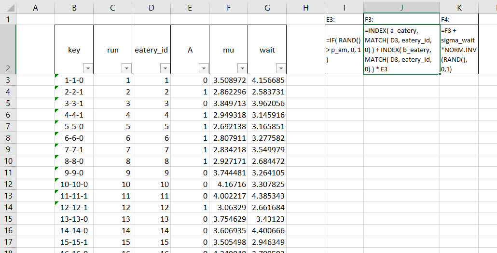

# Waiting for the Simulation

<script>
function showText(y) {
    var x = document.getElementById(y);
    if (x.style.display === "none") {
        x.style.display = "block";
    } else {
        x.style.display = "none";
    }
}
</script>

```{r include=FALSE}
knitr::opts_chunk$set(echo = FALSE, message = FALSE, warning = FALSE)
options(digits = 3, scipen = 9999)
library(visNetwork)
library(tidyverse)
library(kableExtra)
```

## A story of chance

Stan Ulam got sick one day, and it lasted for quite a while. The year was about 1945 . The place, a secret facility in a not so secret desert in the Southwest United States. To wile away the time he played, as many might do, [solitaire, a game of self-imposed patience.](https://en.wikipedia.org/wiki/Patience_(game)) He was a mathematician and soon became impatient with not winning several hands in a row. 

The combinations of  potential hands and their rule by rule repositioning in an ace-high order, and Stan knew this, results in $52! \approx 8.07 \times 10^{67}$ possible games. If he could play 4 games per hour, non-stop, it would take him about $3.29 \times 10^{62}$ years. That wasn't happening! He discussed this idea with his colleague John von Neuman who had just been involved in building the [ENNIAC computer.]() He supposed he could generate $N$ games. 

For each game he determines which proposed game is, or is not, winnable. The number of winnable games is $W$. The relative frequency $f$ of winnable, acceptable games is then $f = w/N$. Next he would let $N$ get larger thinking that the accuracy of this thought experiment should improve. There are after all just two possibilities win or lose, a binary outcome. If there are just two outcomes, and like the flipping of a coin, equally likely or nearly so, then solitaire wins and losses can be modeled by a binomial distribution with $N$ games a probability of a win $p$. and thus a loss $1-p$. The standard deviation of $p = f =w/N$ wins over losses is the sampled $f$ from a binomial distribution of a 1 shot sample (also known as a geometric distribution, but neither here nor there.[^sampled-sd-f]

$$
\sigma_p = \sqrt{\frac{p(1-p)}{n}}
$$


[^sampled-sd-f]: Here's a sketch of the derivation. The sketch includes a manipulation of expectations. Now, we do remember a bit of information about expectations. They are ultimately weighted averages of outcomes, like the $f/N$ we, including Stan, sampled, where the weights are assigned probabilities of occurrence of outcomes. We let $E()$ stand in for this aggregation. Then we remember that the standard deviation is the square root of the variance. The variance in turn is the expectation (weighted probability average) of squared deviations of outcomes from means (which are in turn expectations). If $f$ is a binomial outcome, then $Ef = np$ and $Var(f) = E(f-Ef)^2 = np(1-p)$. Here is the sketch without much, in any, commentary.
$$
\begin{align}
Var(p) &= E(p-Ep)^2 \\
&= Ep^2 - (Ep)^2 \\
p &= \frac{f}{N} \\
Var(p) &= E(f/N)^2 - (E(f/N))^2 \\
       &=(1/n^2)(Ef^2 - (Ef)^2) \\
       &=(1/n^2)var(f) \\
       &=(1/n^2)np(1-p) \\
       &=\frac{p(1-p)}{n}
\end{align}
$$
The standard deviation $sigma_p$ of $Var(p)$ is then
$$
\sigma_p = \sqrt{\frac{p(1-p)}{n}}
$$
Phew! Only a little waving of the hands required.

This means that as the number of sampled solitaire (Klondike style) hands climbs, the standard deviation of relative frequencies declines and thus the process produces more accurate results. The win rate for recreational play has been apocryphally estimated at $p=0.43$. This is almost a random walk. 

John von Neumann, his _computer_ wife Klara von Neumann, and others worked with Ulam's idea, code-named Monte Carlo (it was secret until about 1948) on the ENNIAC computer with its 17,000+ vacuum tubes. They were able to find solutions to problems they had no idea even existed. They also built thermo-nuclear weapons with designs enabled by Monte Carlo methods on the ENNIAC. Haig et al. document the use of the stored program modern computing paradigm installed in the ENNIAC as well as the programs themselves (@Haigh2014),

We might have three or so takeaways from all of this story-telling. First, we should always keep a notebook, the original stored program facility. Second, we can use Monte Carlo to generate new insights through a random brute force method. Third, advances in technology provide a touchstone for technique: always be on the look-out for off trend movements in a domain of knowledge. 

The second takeaway has an important implication for us. Generative models build joint probabilities of highly interrelated groupings of data. In our working example this week we will need the capability of letting multiple eateries communicate with different times of day. With 20 eateries and 2 shifts there are over $4 \times 10^{18}$ possible interactions. That's a lot of potential communication. Conditioning the data will help us pare this down to size. Monte Carlo will help us understand customer experience at the eateries. 

## A piece of pie, please

Tortiere and Fazi started baking vegan pies because they really wanted to open a chain of small eateries where the pies, with salads of course, would be the main attraction. They would also offer coffee, near-coffee as they call products from some chains from the Northwest United States, perhaps liquor and beer, very cosmopolitan.  They hire some restaurant experts to help them understand some of the business side of an eatery. The so-called experts build a robot. This is a pie-eating-robot, not a person, but a machine that can sense, observe, build probability tables for how long it takes to get served.

Our model (we are the so-called experts) should be able to go from one eatery to another with memory. and we We do remember that last time we ordered a cup of coffee and a piece of pie at a lunch counter eatery. The model should also be able to the same eatery or another in the morning or the afternoon. Time of day traffic at eateries could be different, exhibiting different customer experiences. The primary metric we elicit from our clients is their concern over how long a customer remains in line, gets to order, and receives the order. Too slow and the customer might bolt next door and  eat meat pies. Too fast and  service quality, including basic courtesy might jump out of the back window.

We will program a robot to visit two eateries, order coffee and a piece of pie, and
estimate the waiting times at each. The robot enters the first eatery, either in the morning or in the afternoon. The pie-eating-robot begins with a vague idea for the waiting times, say with a mean of 5 minutes and a standard deviation of 1. After ordering a cup of coffee and a piece of pie at the first eatery, the robot observes a waiting time of 4 minutes, an observation below the mean, about 1 standard deviation's worth. It updates its probability of being at this eatery, the so-called entry, just getting in the queue, prior distribution, using Bayes’ theorem of course, with this information. This gives it an exit, resulting, otherwise known as a posterior distribution for the waiting time at the first eatery.

Now the robot moves on to a second eatery. It might be morning or afternoon. When this robot arrives at the next eatery, what is its expectation upon entering, the so-called prior, the probability that the next eatery is to be entered? It could just use the resulting distribution, also known as a posterior, from the first eatery as its entry distribution, also known as a prior, for the second eatery. But that implicitly assumes that the two pie-eateries have the same average waiting time. Eateries are all pretty much the same, but they aren’t identical. 

On the other hand, it doesn’t make much sense to ignore the observation, the experience of waiting, from the first eatery. That would make the robot have amnesia and we want the robot to remember, and possibly compare. So how can the eatery customer-robot do better? It needs to represent the population of eaterys and learn about that population. The distribution of waiting times in the population becomes the prior, the probability, for each eatery, until, and if, the pie-eating-robot encounters a new customer experience, which will be compared with and conditioned by prior experiences.

Whatever the eatery, the robot has a simple model in its robotic cortex.

$$
\mu_{i} = \alpha_{i} + \beta_{i}A_i
$$

where $\mu_i$ is the average waiting time in minutes at eatery $i$, $\alpha_i$ is the average morning waiting time, $\beta_i$ is the average difference in morning and afternoon waiting times, and $A_i$ is a zero/one indicator of whether we are in the afternoon shift, 1, or present ourselves to the morning shift, 0. 

```{r}
a <- 3.5 # average morning wait time
b <- (-1) # average difference afternoon wait time
sigma_a <- 1 # std dev in intercepts
sigma_b <- 0.5 # std dev in slopes
rho <- (-0.7) # correlation between intercepts and slopes
Mu <- c( a , b )
sigmas <- c(sigma_a,sigma_b) # standard deviations
Rho <- matrix( c(1,rho,rho,1) , nrow=2 ) # correlation matrix
# now matrix multiply to get covariance matrix
Sigma <- diag(sigmas) %*% Rho %*% diag(sigmas)
#Sigma
N_eateries <- 20
library(MASS)
set.seed(5) # used to replicate example
vary_effects <- mvrnorm( N_eateries , Mu , Sigma )
a_eatery <- vary_effects[, 1]
b_eatery <- vary_effects[, 2]
##
set.seed(22)
N_visits <- 10
afternoon <- rep(0:1,N_visits*N_eateries/2)
eatery_id <- rep( 1:N_eateries , each=N_visits )
mu <- a_eatery[eatery_id] + b_eatery[eatery_id]*afternoon
sigma <- 0.5 # std dev within eateries
wait <- rnorm( N_visits*N_eateries , mu , sigma )
d <- data.frame( eatery=eatery_id , afternoon=afternoon , wait=wait )
```

Eateries covary in their intercepts and slopes. Why? At a popular eatery, wait times are on average long in the morning, because staff are very busy, in a word, slammed. The eatery might be the only place open for blocks, but the same eatery might be much less busy in the afternoon, leading to a large difference between morning and afternoon wait times. At such a popular eatery, the intercept is high and the slope is far from zero, because the difference between morning and afternoon waits is large. But at a less popular eatery, the difference will be small. Such a less than popular eatery would make us wait less in the morning, because it’s not busy. and there is not much of a change in the afternoon. In the entire population of eateries, including both the popular and the unpopular, intercepts and slopes covary. This covariation is information that the robot can use.

## A brief interlude with Cholesky

The information structure we impose on the customer-robot relates morning and afternoon wait times. We model this as covariance,  eqivalently as correlation, which is covariance scaled (divided) by the product of the standard deviations of morning and afternoon. Scaling forces a covariance that can possibly range from negative to positive infinity into a far more useful range between -1 and +1. If we (through a scanner darkly[^pkdick] with our robot, that is)

[^pkdick]: Pilfered directly from Philip K. Dick's memorable novel, [_A Scanner Darkly_.](https://en.wikipedia.org/wiki/A_Scanner_Darkly) Our aim is not at all as dystopic as Dick's.

We have two random parameters, so our problem is like this one. Given a $2 \times 2$ standardized variance-covariance matrix, also known as a correlation matrix, $R$, where $\rho$ is the coefficient of correlation, 

$$
R =
\begin{bmatrix}
1 & \rho \\
\rho & 1
\end{bmatrix}
$$

We start with uncorrelated variates $x$ from no particular distribution. Our job is to transform the uncorrelated variates to produce correlated variates $z$ with the same expected variance-covariance matrix as $R$. This will put informational structure into the otherwise independently occurring $x$.

When we say transform we mean this mathematically.

$$
z = Lx
$$

such that

$$
R = LL^T
$$

This may be a tall order if it weren't for a trick we might have learned when solving simultaneous equations called triangularization.

## Solution

We can decompose $R$ into the product of upper and lower triangular symmetrical matrices. This is the standard trick of matrix algebra noted above.

$$
R = 
\begin{bmatrix}
1 & \rho \\
\rho & 1
\end{bmatrix}
=
\begin{bmatrix}
\ell_{11} & 0 \\
\ell_{21} & \ell_{22}
\end{bmatrix}
\begin{bmatrix}
\ell_{11} & \ell_{21} \\
0 & \ell_{22}
\end{bmatrix}
$$

When we multiply the upper and lower triangular matrices we get this interesting matrix.

$$
R =
\begin{bmatrix}
1 & \rho \\
\rho & 1
\end{bmatrix}
=
\begin{bmatrix}
\ell_{11}^2 & \ell_{11}\ell_{21} \\
\ell_{11}\ell_{21} & \ell_{22}^2
\end{bmatrix}
$$

Now we use another trick by matching elements of $R$ with the elements in our new matrix. Here we go.

- $\ell_{11}^2 = 1$ implies $\ell_{11}= 1$
- $\ell_{11}\ell_{21} = \rho$ then implies $\ell_{21} = \rho$
- $\ell_{11}^2 + \ell_{22}^2 = 1$ then implies that $\ell_{22} = \sqrt{1 - \rho^2}$

That wasn't as bad as we might have thought when we started. We then let $L$ be the new mashed up $R$ matrix.

$$
L =
\begin{bmatrix}
\ell_{11} & 0 \\
\ell_{21} & \ell_{22}
\end{bmatrix}
= 
\begin{bmatrix}
1 & 0 \\
\rho & \sqrt{1 - \rho^2}
\end{bmatrix}
$$

This matrix can be expanded to more than 2 dimensions. The procedure to make that happen is called a [**Cholesky** factorization](https://en.wikipedia.org/wiki/Cholesky_decomposition), really an algorithm, well beyond these proceedings, but on a path for Monte Carlo generation.

## Now we can simulate

We generate correlated $z = Lx$ building on the uncorrelated $x$. We first generate a random $x_1$ and, independently, a random $x_2$. We can use the `=RAND()` function in Excel to perform this task.

$$
x =
\begin{bmatrix}
x_1 \\
x_2
\end{bmatrix}
$$
Then we generate a $z_1$ and a $z_2$ using the $x$ vector of random numbers, but transformed by pre-multiplying $x$ with $L$.

$$
z = 
\begin{bmatrix}
z_1 \\
z_2
\end{bmatrix}
=
\begin{bmatrix}
1 & 0 \\
\rho & \sqrt{1 - \rho^2}
\end{bmatrix}
\begin{bmatrix}
x_1 \\
x_2
\end{bmatrix}
$$
We do remember that By definition, if $x_1$ is not correlated with $x_2$, then $\rho_{12} = 0$. We can check our maths with this calculation.

$$
xx^T
=
\begin{bmatrix}
x_1 \\
x_2
\end{bmatrix}
\begin{bmatrix}
x_1 & x_2
\end{bmatrix}
=
\begin{bmatrix}
x_1^2 & x_1 x_2 \\
x_1 x_2 & x_2^2
\end{bmatrix}
=
\begin{bmatrix}
1 & 0 \\
0 & 1
\end{bmatrix}
$$

The multiplication of a column vector of independently drawn $x$ with its transpose, the row vector of thos same $x$ random numbers will always return the the identity matrix $I$. This shows that variates are perfectly correlated with themselves but not each other.

Back to the main business at hand. We now calculate

$$
zz^T = (Lx)(Lx)^T = Lxx^TL^T = LIL^T = LL^T
$$

But, $R = LL^T$ so that $R = zz^T$.

Thus we have sketched out these steps.

- Generate uncorrelated $x$.

- Generate $z = Lx$, where $L$ reflects the desired correlation structure.

- Find that $L$ generates the same correlation structure as the correlations in $z$.

### Excel or bust!

Here is a demonstration in Excel. It will use VBA without apology.


Vectors of $x$ and $z$ flank the correlation matrix $R$ and the transformation matrix $L$, just like the maths. We name the region B2:N3 `calculation. The $x$ vector is populate with RAND() functions. These will always return a uniformly distributed random number between 0 and 1. This will act like a probability if we would like to shape the draws into something more usful to our purposes.  We use the MMULT() array function to matrix multiply $L$ and $x$ to get $z$. We then simulate this act 10,000 times.

To simulate we designate the Q3:T3 range by naming it `interface`. This is a go-between region that mediates the calculations with the presentation of a single run to another named range called `simulation`in cells Q5:T5.

We then (cleverly) write a routine that replaces our fingers. They would otherwise press F9 10,000 times to recalculate the sheet, drawing new $x$ values and transforming them into new $z$ values. Each time the fingers would drop a copy of the interface value row into the next available row below the `simulation` range Q5:T5, and do it all over again, shall we say it again? Yes, 10,000 times. We replace this labor intensive work with this Visual Basic for Applications (VBA) code which may be viewed by pressing the Visual Basic button in the Developer ribbon.


We might some appropriate pithy remark in the MsgBox. We can also change the number of simulations to some other assumption of the analysis by editing the FOR-NEXT loop. Otherwise, this code is self-sufficient and ready to reuse. We simply specify the named ranges. The rest is nicely automated. Assigning this subroutine to a button finishes the job.

## Back to the eatery robot

The robot enters an eatery and observes waiting times. We will have this robot do this many times in the morning and / or the afternoon for 20 eateries, thus the simulation.

Here is the setup, calculation and graph for the random $\alpha_i$ waiting time intercepts correlated with $\beta_i$ afternoon waiting time differentials. This table is the starter for the rest of the waiting time simulation. It represents our prior expectations about the range and shape of morning intercept times and afternoon slope times. We will use this table in the main simulation in the next section.


The intercepts and slopes for 20 eateries plots a negative relationship. We shape the random variates into Gaussian (normal) distributions. In an x_1 cell in column F we make a normally distributed random variable with a 0 mean and 1 standard deviation. This is none other than the centered and scaled normal z-score. NORM.INV() will report the number of standard deviations away from 0 corresponding to a probability, here drawn as a number from 0 to 1 with RAND(). But we need a probability version of this drawn that transforms z's that may positive or negative and very large or very small into a probability. That magic we perform with NORM.DIST set to TRUE, the cumulative normal density distribution. In the end we get a normally distributed random number with mean zero and standard deviation one.

We move to an x_2 cell in column G where we _Cholesky_ (a new verb, perhaps) the x_1 normal random number into a new normal (pun intended!) but correlated random number. We use the second row of the Cholesky matrix, which when multiplied by another randomly drawn x_2 in Excel gives us in Excel this algebraic formula.

$$
z_2 = \rho \, x_1 + \sqrt{1-\rho^2}\, x_2
$$

We remember that $z_1 = x_1$ in the Cholesky transformation. Maybe this is too much information, but it does come in handy when numbers blow up or do not at all align with anyone's common sense.

We then get to the random intercepts and slopes in columns H and I. The hard work has already been done. We draw normal variates with mean and standard deviations already specified for a and b. The graph concurs with our expectations that they are random and negatively correlated.  

### The main course

The robot randomly enters eatery number one and orders again, and possibly, again, or goes to eatery number two to do the same. The robot may go in the morning, or possibly in the afternoon. We and the robot do not expend any calories, get heartburn, or even have a good time. The robot only cares about how long it takes to get served.
from the data. This means the robot tracks parameters for each eatery and time of day.



We introduce more, uncorrelated, uncertainty by allowing the customer-robot to choose whether to sample an eatery in the morning $A=0$ or afternoon $A=1$. We use the IF() statement to make a choice with a threshold of p_am. Basically this is Jakob Bernoulli jum probability. The robot jumps into the eatery in the morning if a uniformly drawn RAND() number exceeds this threshold, otherwise wait for the afternoon shift. 

We calculate the average wait time using each eatery_id in an INDEX(MATCH()) statement to lift the correct intercept $\alpha_i$ and slope $\beta_i$ for eatery $i$. We then add intercept to the slope times the 0 or 1 afternoon marker. This is the mean, along with an assumed standard deviation that samples a waiting time from a normal distribution in the wait column. We do this 2000 times. 

With all of this data it behooves us to study it closely.

### Exploring wait times

We now have 2000 logically related versions of how 20 eateries with two shifts, morning and afternoon produce wait times for wary and unwary customers. We did this by building a logically endowed robot to perform the calculations all in Excel. Here is the workup in a separate worksheet called eda (for @Tukey1977 exploratory data analysis).


There are three tables. The one on the left at the top builds the parameters for an equally spaced set of intervals from which we can count the number of wait time results occur in the interval. All of that action occurs in the table to the right. Just below the grid parameter table is a summary of results.

We compose a typical data summary with these items:

1. Maximum, minimum, and the 25th, 50th, and 75th quartiles, since they break the data into four parts. All four are measures of location. We measure centeral tendency with the median. Generally these are all we need to make a box plot. We also record the Interquartile Range (IQR), a scale metric useful for helping us determine outliers. 

2. Mean and standard deviation to get other measures of location and scale. We also compare with median with the mean and see they are very close. 

3. Skewness measures how lopsized, asymmetric the distribution of data is. Kurtosis is very nearly a scaled standard deviation of the standard deviation. It measures the thickness, or thinness, of the tail where we find less frequent outcomes. This data is nearly symmetric with a meso-kurtic, a medium-thick, tail. It so looks like the normal distribution, and it should, since we sampled from this distribution in the first place.

4. Other measures such as the data can be included.

Now off to the right is a table where we calculate, using 21 intervals, the frequency, relative frequency, and cumulative relative frequency of the data occurring in intervals. We use enough intervals with interval mid-point spacing designed for the use of managers and other decision makers. The documented cells at the bottom of the table document the way we construct intervals and their mid-points. We use  midpoints in graphing. We count the integer number of times that a wait time we just sample happens to occur in a an interval. 

The Excel function COUNTIFS(array, criterion, array, criterion) does the heavy lifting for us. An array here is the vector of wait times. All criteria are logical statements. The syntax for a finding the number of wait time samples in an interval with beginning of interval value in a cell and an ending of interval value in another cell is ">="&begin_cell and "<"&end_cell. The very last interval, to ensure we count all of the data has a "<="&end-cell logical statement. We check each of the beginning and ending interval cell formulae and the logical criteria to count wait time observations.

In the last column of the table we compute the normal (Gaussian) cumulative distribution function (CDF) version of cumulative relative frequency. We use mid-points from our interval estimations and the mean and standard deviation from the data summary table. We set the last argument to TRUE to calculate the CDF. Our mechanical work is done. Here is a graph of the results.


We see that the simulation and normal CDF's nearly collide into one another. The utility of a distribution like this is to help us ask how certain are we about average wait times? Probability intervals with lower and upper bounds will help us allocate scarce resources in a more principled fashion. We continue to remind ourselves that models are abstractions from reality, they are not customer experience, or the staff and facilities needed to enhance the experience.

## Any next steps?

We certainly should take a paste-values frozen copy of the simulation, split it into morning and afternoon sections and run the same exploratory data analysis on the splits. This will enable us to determine whether the eateries have much the same or radically different customer experiences. 

We can also ask the question about which eateries are more or less popular, if we think popular is longer wait times for both morning and afternoon shifts. If popular, the conjecture is that longer wait times are due to customer congestion. Unfortunately they could be due to staff shortages, relatively less trained staff or even the physical configuration of an eatery. But at least we have a start on beginning to advise Make-A-Pie.

Can we use this model in other settings? We might try to map the parameters of this model to other processes. For example the model might apply to analyze queues at vaccination sites. We might also conceive of the use of the model for tracking time to correct faults in geographically distributed electric and gas equipment. We might also use this sort of model in any environment where the number of steps, the number movements, the distance to and from, varies by some category in time and space (physical and imaginary) and where the categories are correlated. As always one size will probably only fit one. Customization will require further scoping, designing, and implementing.

## References and endnotes

