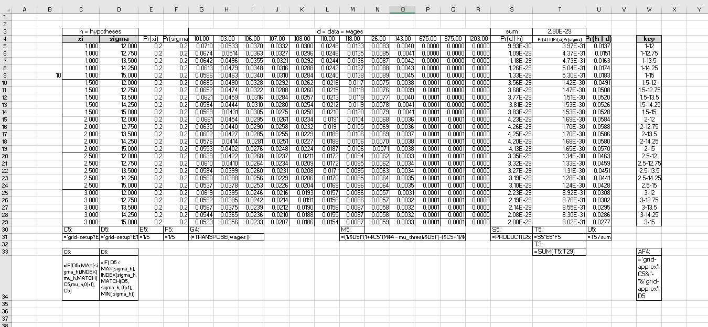
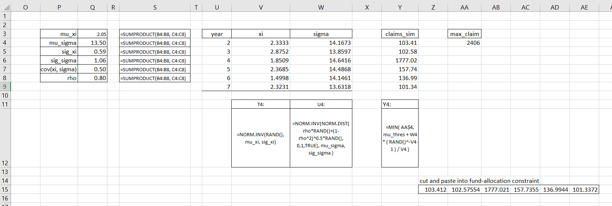
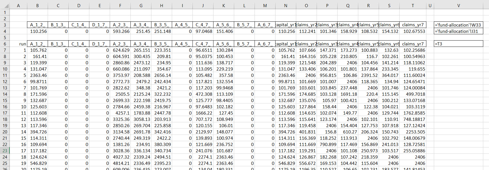
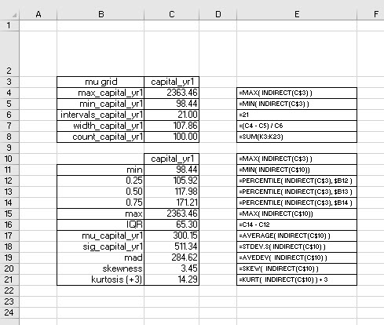
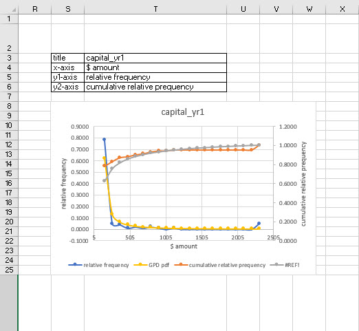

# The Outer Limits

<script>
function showText(y) {
    var x = document.getElementById(y);
    if (x.style.display === "none") {
        x.style.display = "block";
    } else {
        x.style.display = "none";
    }
}
</script>

```{r include=FALSE}
knitr::opts_chunk$set(echo = FALSE, message = FALSE, warning = FALSE)
options(digits = 3, scipen = 9999)
library(visNetwork)
library(tidyverse)
library(kableExtra)
```

```{r, eval = FALSE, echo = FALSE}
Threshold <- 100
x <- read.csv("claims.csv")
gdata <- data.frame(x = x[,2]) #Threshold + rexp(n = 3000, rate = 2))
fit <- vglm(x ~ 1, gpd(threshold = Threshold), data=gdata, trace = TRUE)
head(fitted(fit))
summary(fit)
```


## Tales of tails

Rod Serling portrayed the edge of human dire straits and decisions in his classic TV series, _The Twilight Zone_.[^where] We will go to the edge in this round of simulation, but we hope, not too far over the edge of our capabilities to analyze. The edges and horizons of our work will be peering into the tails of distributions of decision outcomes. One of these outcomes is workers compensation claims experience.

[^where]: Local lore places the zone at a now decommissioned train station in Dryden, NY. Serling ran the entire series with his company Cayuga Production, anmed for the lake where Serling's family owned a summer home Ithaca, NY, not far from Dryden on, yes, Route 13. 

Let's set the scene. Make-a-Pie owner Simone Tortiere meets regularly with other vegan food  company owners. This week their agenda covers the rising incidence of and cost of covering workers compensation claims. A claim arises when a worker, on the job, becomes disabled for any reason. The [New York State Insurance Fund (NYSIF)](https://ww3.nysif.com/Home/Employer/LookingForInsurance/NYSIFInsurancePlans) offers several plans and products to employer policy-holders. The vegan company owners around the table at host [Candle Cafe](http://www.candle79.com/) try to get a handle on claims, rejection of claims, required drug formularies and treatment codes, increasing cost of disability, loss of key personnel, among other things. 

Many of the vegan businesses are NYSIF policy-holders. For example, if a covered worker falls, has extended health issues, the fund will cover expenses for a specific time frame, using specified drug and other therapy treatments, all under the direction of NYSIF medical associates. Premiums will undoubtedly rise with more claims experience. Safety Group plans, while paying dividends to policy-holders with relatively low claims experiences, often groups all food-related workers into one class. This may, or may not, disadvantage the vegan food industry. 

The group decides on this course of action.

- Gather workers compensation claims experience across the group

- Attempt to model future claims to understand the range and shape of the distribution of claims, all based on existing claims experience

- Use the future claims model to simulate a self-insurance portfolio

All of this is a very tall order for experts in vegan food production and service. Tortiere has already talked to us about the issues. She recommends that our analytics service can at least start to structure the group's next conversation in a month with some provisional results.

## It always starts with data

Not really, because we actually begin with Tortiere's question: can we insure ourselves and be better off? Yes, then we begin our analysis by gathering 12 years of annual workers claim experience from several of the vegan establishments. 


This is only a small sample of owners experience, all in hundreds of thousands of dollars. We visualize the times series.


Two patterns emerge. There seems to be a base-line of claims experiences. But there are several very large experiences as well. We ask is there some sort of threshold that splits the analysis of claims experience? 

Well a well-known exploratory technique exists to examine the behavior of data, especially extreme values in this claims data. We see that @Tukey1977's outlier fences detect outliers above a threshold claims level of \$529,000. Another technique develops an excess of high threshold series. We generate a series of possible thresholds $u$. Then we sort the claims from lowest to highest. For each threshold and claim $x$ we calculate the excess of threshold metric.

We use this tool to evaluate this metric.

$$
\operatorname{max}(x, y) = \frac{x+y+|x−y|}{2}
$$

Let's try this with $x=0$ and $y = 5$. We remember that we are trying to measure claims 5 in excess of a threshold of 0.

$$
\begin{align}
e(u) &= \operatorname{max}(0, x -  u ) \\
     &= \frac{x+y+|x−y|}{2} \\
     &= \frac{0+5+|0−5|}{2} \\
     &= \frac{5+5}{2} \\
     &= 10 / 2 \\
     &= 5 \\
     &= (5 - 0)_+ 
\end{align}
$$

This case seems to work. This works only because when and $x > y$, then $x-y < 0$ and $|x-y| = y-x > 0$. Here we flex our algebraic muscles to verify this relationship.

$$
\begin{align}
e(u) &= \frac{0 + (x-u) + |0 - (x - u)|}{2} \\
     &= \frac{x-u + |- (x - u)|}{2} \\
     \text{ if } x>u \\
e(u) &= \frac{x-u + x - u}{2} \\
     &= \frac{2x - 2u}{2} \\
     &= x -u\\
     \text{ if } x \leq u \\
e(u) &= 0     
\end{align}
$$

We can use this analysis to program spreadsheet cells. We use the subscript $+$ to economize on notation. Next we average $e(u)$ for each threshold. We remember from somewheere, maybe an elementary statistics course, the for $u$ a constant that $\operatorname{E}u = u$.

$$
\begin{align}
\operatorname{E}e(u) &= \sum_i^{N_u} \pi_i (x_i - u)_+ \\
                     &= \pi_1 (x_1 - u )_+ \ldots \pi_{N_u} (x_{N_u} - u )_+ \\
                     &= \operatorname{E}x - u
\end{align}
$$

On the other hand does the variance of $e(u)$ have anything at all to do with $u$?

$$
\begin{align}
\text{ if } x > u \\
\text{then} \\
\operatorname{Var}e(u) &= \operatorname{E}[e(u) - \operatorname{E}e(u)]^2 \\
     &= \operatorname{E}[(x-u)^2 + (\operatorname{E}x - u)^2 - 2(x-u)(\operatorname{E}x - u)] \\
     &= \operatorname{E}[x^2 - 2ux + u^2 + (\operatorname{E}x)^2 - 2u\operatorname{E}x +u^2 - 2x\operatorname{E}x + 2u\operatorname{E}x - u^2] \\
     &= \operatorname{E}x^2 - (\operatorname{E}x)^2 + u^2 - 2u\operatorname{E}x \\
     &= \sigma_x^2 + u^2 - 2u \mu_x
\end{align}
$$

We can use these calculations to build probability intervals around $e(u)$ should the desire ever percolate to the surface.

Expectations build around a number $N_u$ of non-zero $e(u)$ values. It is possible that there are less than $N$ observations for which a claim $x$ only exceeded a threshold $u$. It is very possible that given a stream of claims, a very few set of claims which exceeds a high threshold will occur and thus we can state another rule of the excess over threshold story that $N_u \leq N$.

Here we calculate the mean excess of claims over a series of potential thresholds $u$.


Wenotice that there are a lot of zeros in this table. That is a direct result from just considering only positive differences $x-u$. We use this idea to calculate a conditional mean with the AVERAGEIF() function. We generate the thresholds $u$ on an equally spaced grid. What is $N_u$? In column L after all of the zeros we are left with $N_u=3$, and in column N $N_u=2$. We look at Now for the plot of all of this handiwork.


The plot is a straight line until some turbulence occurs as the threshold approaches the maximum value of claims in the data. This usually indicates that the following distribution will work well to match this data.

## A distribution to remember

We need an observational model with these qualities:

1. It generates a regularly occuring ranges of outcomes.

2. On occasion the distribution generates very high outcomes.

3. It will be relatively easy to implement.

Well, we always hope for 3) but will get by with 1) and 2). Such a distribution is the [Generalized Pareto Distribution (GPD)](https://en.wikipedia.org/wiki/Generalized_Pareto_distribution) built on ideas by the Italian civil engineer, sociologist and economist [Vilfredo Pareto](https://en.wikipedia.org/wiki/Vilfredo_Pareto) at the turn of the last century. The very high outcomes he observed were wealth in the hands of an elite. For us, its just a lot of bad work days in a year, no elites are involved. The GPD has been used in quality control for manufacturing, epidemic outbreaks, severe weather, finance collapse, and political violence. We use it for workers compensation claims experience

Here is the probability distribution function. There are three parameters, location $\mu$ is a threshold of claims $x$, $\sigma$ is the scale or dispersion of claims, $\xi$ is the shape of claims that allow thick or thin tails in the distribution. That last quality is crucial. It marks a way to measure kurtosis in our observational model.

$$
Pr(x \mid \mu, \sigma, \xi) = (1/\sigma)[1 + \xi (x-\mu) / \sigma ]_{+}^{- (1+ \xi )/ \xi}
$$ 
where $\mu>0$ is the location parameter (a known value, the threshold), $\sigma > 0$ is Again we use the short hand notation $h_+ = \max(h,0)$. If $\xi<0$, then we are taking a root of a negative number in the square brackets. We must not! At least not here as this will entail complex numbers, a fate we do not want to tempt, again, at least here. If $\xi$ should wander into a negative range, then this condition must hold true, or else, we have a singular model, and we will get a !NUM error in Excel.[^taleb]

[^taleb]: What distribution to choose? @Taleb2019 has a bit to say about the matter, and very technically, and practically, so.

Here we isolate the $x$ to get an idea of what range (mathematicians sometimes call this a support) $x$ can take on before the model blows up.

$$
\begin{align}
1 - \xi (x-\mu) / \sigma &< 0 \\
1 &< \xi (x-\mu) / \sigma &< 0 \\
\frac{\sigma}{\xi} + \mu &< x \\
x &> \frac{\sigma}{\xi} + \mu
\end{align}
$$
In other words, $x$ definitely needs to be greater than the $\mu$ threshold. In general, the support is $x>\mu$ for $\xi>0$, and $\mu < x < \mu-\sigma / \xi$ for $\xi<0$. This will be our observational model. Such a model takes a $\xi,\,\sigma$ combination as a conjecture, for a given level of threshold $\mu$, a hypothesis as a given, a condition. 

The model computes the probability that a $x$ occurs given this conjecture. Of course, we conjecture many combinations of the shape and scale parameters. Which one do we pick? The most plausible one. It turns out that the most plausible hypothesis is the hypothesis with the highest probability of choosing a particular hypothesis of $\xi,\,\sigma$ given all of the data we have available, here 12 annual observations of claims.

How do we get to that probability? We simply find the probability that **both** the data occurs, given a hypothesis, **and** the probability that the hypothesis itself occurs. We calculate the probability both of the data in a model and of the probability of the hypothesis as the product of the probabilities. This is justly called the [**Law of Conditional Probability**.](https://en.wikipedia.org/wiki/Conditional_probability)

$$
\operatorname{Pr}(x \wedge (\sigma, \xi)) = \operatorname{Pr}(x \mid \sigma, \xi)\operatorname{Pr}(\sigma)\operatorname{Pr}(\xi)
$$
The little wedge $\wedge$ means **and** and the $\operatorname{Pr}(\mu) = 1$, means we know $\mu$ with certainty, after all we are setting it ourselves. But that does mean there will be some scrutiny to assure ourselves of the level of the threshold.



Yes, this a beast of a table. But while there is a lot going on here, we can start from left to  right and top to bottom. This calculation machine is our claims-robot's cerebral cortex in its separate [grid-approximation](https://journals.plos.org/ploscompbiol/article?id=10.1371/journal.pcbi.1002803) worksheet.[^grid] A grid on the left has all of the conjectured $\xi$ shape and $\sigma$ parameter combinations from the grid-setup worksheet. This table is pivotable, a task we perform in the next worksheet.

[^grid]: Grids, and techniques to approximate functions like our GPD, are popular in many fields, including option pricing in finance, queue measurement in operations, customer sentiment analysis in marketing, reservoir flow in hydrological engineering, and beam stress analysis in civil engineering. We already used grids to optimize Simone Tortiere's pie price in our first outing with decision models.

We can unpack the `IF()` statements in cells C6 and D6 by realizing that we must stay at the same `xi_h` only while we loop through the list of `sigma_h`s, otherwise move to the next `xi_h`. Cells C5 and D5 start the parade with the beginning entries of the `xi_h` and `sigma_h` lists.

Cell C6 tests whether the previous D5 is the end of the `sigma_h` list by using the `MAX()` function. If true then the `INDEX(..., MATCH())` retrieves the next `xi_h`, otherwise stay at the same `xi_h` in cell C5.

At the same time, the `IF() statement in D6 tests whether or not the `sigma_h` in D5 is the last `sigma_h` in the list. If true, then go back to the beginning of the `sigma_h`, otherwise go to the next `sigma_h` in the list. 

We end up With 25 nodes, that is, $5 \times 5 = 25$ hypotheses, in a grid. We can then proceed to use the GPD observational model, one fit for use with location, $\mu$ is the threshold, shape, approximated by `xi_h`, and scale, $\sigma$, approximated by `sigma_h`.

Our next stop on the magical mystery tour is the mashing together of observed data with the unobserved data of hypotheses, all 25 combinations of set $\mu$ and approximated $\sigma$ and $\xi$. These hypothetical parameters turn up in the GPD observational model again, here for reference.

$$
Pr( x \mid \xi, \, \sigma) = \frac{1}{\sigma} \left[1+\xi\left(\frac{x-\mu}{\sigma}\right) \right]^{-(1+\xi)/\xi}
$$

This distribution is less beastly than the Gaussian (normal) distribution, after all it does not have $\pi$ in it! So we just drop in one of the claims observations for $x$, and one of the $\xi,\,\sigma$ combinations from the 25 node grid and compute. There will be $12 \times 25 = `r 12*25`$ such calculations, much more effectively and efficiently performed in the spreadsheet. 

For example, the probability of observing $x=101.00$ given a hypothesis that $\xi=1.00$ and $\sigma=12.00$ is $0.0710$, found in the first calculation cell F5 of the table. Then we calculate the probability that the next claim occurs under the same condition, and so one until we get to the end of the 12 claims observations. We now have 12 probabilities that observations occur, all conditional, in this row, on the same hypothesis $\xi$ and $\sigma$.

To calculate the probability that we see both observation 1 and observation 2 and, $\ldots$, observation 12, we multiply all of the probabilities together with the PRODUCT() function. We now find the probability both of the data, $\operatorname{Pr}( x \mid \xi, \, \sigma)$ and of the hypotheses, $\operatorname{Pr}(\xi)$ and $\operatorname{Pr}(\sigma)$. the hypotheses probabilities are in columns E and F, We assume all hypotheses are equally likely until we happen to update our assumptions. We multiply the three probabilities together and now we have this expression all up and down column T. 

But the next column U tells the story. We take the column T joint probabilities, sum them up to get the grand total probability both of all of the data and all of the hypotheses. We use this grand total probability to normalize each of the column T joint probabilities. How do we do that? In column U we divide each cell in column T by the grand total probability.  This ends up computing the one thing we have been looking for all along, the probability of a particular hypothesis given the data. Column U is the contribution of each joint probability to the medley of mashing together data and conjectures about the data.

## What does it all mean, so far?

Does our grid tell us anything useful? On its own it is not in a form easy to interpret. We have the raw $\operatorname{Pr}(\mu,\,\sigma \mid wages)$ in column U. We did build a key in column W above. Now is the time to put it to good use. We need to calculate the total probability of any particular $\mu$ or $\sigma$. Here is the ultimate grid that relates each hypothesized $\mu$ with each hypothesized $\sigma$. The link between them is the probability both of $\mu$ and $\sigma$, that is, $\operatorname{Pr}(\mu,\,\sigma \mid wages)$ in column U.


Right in the cross-hairs is the maximum joint probability of $\xi$ and $\sigma$. These indicate the maximum probabilities of hypotheses and the value of those best hypotheses $\xi=2$ and $\sigma=13.5$.

The marginal probability of $\operatorname{Pr}( \xi = 2.00)$ is the highest density in the I column. We calculate it realizing that this probability must take into account any of the ways in which $\xi=12.00$ interacts jointly with each of the hypothesized $\sigma$'s. The key word in the last sentence is the indefinite pronoun _any_. This pronoun denotes an _either-or_ proposition: either $\sigma=12$ or  12.75 or, ..., 15. Either-or situations have probabilities that add up and thus the `SUM()` in cell I5.

Similarly the marginal probability of $\operatorname{Pr}(\sigma = 13.5 )$ is the highest density for the hypthesized $\sigma$s. This probability is also the sum of the either-or probabilities of $\sigma = 10$ interacting jointly with any of the hypothesized $\mu$s. We often refer to this calculation as integrating out, in this case, the $\mu$s for each $\sigma$, and _vice-versa_ for integrating out the $\sigma$s for each $\mu$.

Thus we end our estimation of the hypotheses which are most compatible with the claims data. We now have the ability to simulate the claims experience in a principled way.

## The joint's ajumpin'

We know that $\xi$ and $\sigma$ are joined at the hip. The estimation table is a joint probability table. Let's investigate further. We will calculate the mean, variance (standard deviation), and covariance (correlation). In this way we can generate claims with correlated shape and scale parameters exactly in the manner we did with waiting times using Cholesky Factorization.

In this table we first calculate the expectations of $xi$ and $\sigma$ for means, standard deviations and covariances. These are weighted averages with probabilities and grid outcomes ported directly from the $\xi \times \sigma$ table. The probabilities for the covariance calculation are the diagonal joint probabilities in that table. Since they do not add up to one we follow our standard practice by normalizing them using their sum. 


Using this calculation apparatus we can then calculate the means, standard deviations, covariance, and correlation that summarize the joint estimation of claims shape $\xi$ and scale $\sigma$. Using these parameters we can then simulate correlated versions of $\xi$ and $\sigma$ for each of 6 funding years we will forecast for the self-insurance discussion.

We now have the parameters and the one run simulation of $\xi$ and $\sigma$ values for each of the forward years we will include in our burgeoning fund analysis. We also set a maximum claim size to keep our model from exploding.

It turns out we can generate GPD variates with this formula for $\xi \neq 0$.

$$
Y =\mu + \frac {\sigma (U^{-\xi }-1)}{\xi } \sim GPD(\mu ,\sigma ,\xi \neq 0)
$$

If $U$ is uniformly distributed on (0, 1], we can use RAND() in our spreadsheet. Here is a revised one run simulation with simulated claims. Finally!



In fact this run looks a little like the experience of claims in the small sample. There are several threshold level claims and a nearly 2x claim to thicken the tails of this kurtotic distribution.

## A sinking feeling?

The Vegan Workers Insurance Fund (VWIF, Fund) would be a monoline insurance fund Federally chartered, operating in New York State, with strategic partners chartered in Bermuda. The  fund would specialize in vegan food industry worker compensation risk. As an insurance fund it considers the matching of claims exposures with investments needed to fund claims over a several year period. Premiums charged will depend on the riskiness of the funding, and the variability and size of claims over time. In this way the Fund operates similarly to any sinking fund where cash flow obligations occurring over several time periods must be met with a slate of investment returns.

As a first step, Fund investment analysts would propose a slate of potential funding opportunities while claims analysts determine potential exposures over time. The slate of potential investments reflect the monthly timing of expected cash flow in along with annual annual returns. At the same time, claims are cash flows determined by analysis of various risk drivers and exposures. Our model takes the more naive approach to jump-start the analysis of claims using the GPD to model exposures.

The fund would have a 7 year mandate to meet claims. A 7th year is required to manage overlaps in coverage among participants and restart the investment allocations. Here is the expected claims schedule based on data collected from a small sample of vegan establishments and projected for years 2 to 6. The first year is the funding period for this tranche of exposures.

The main constraint is to have investment surplus from proceeds equal claims requirements. The calculation of investment surplus $S_t$ for each year $t=2,\ldots,7$. A return $r_{it}$ from investment $i$ at year $t$ accrues according to the schedule of years of cash flow for each investment. These abstractions become a bit clearer in this next panel.


Our objective is to minimize the front-end investment in year 1. In calculating premia for each policy-holder we can levelize payments according to the capital needed by year. This process is not shown here and would be quite a good exercise. For now we content ourselves with understanding this version of a funding model. In this model we add all of the investments that start with year 1 using the SUMIF() function.

We choose levels of capital to invest in each of the A, B, C, D funds. These funds have starting and ending years. Each then earns a different time-based return. We flow a \$1 dollar (-1) in a starting year across the holding period of the fund to earn at the end of the holding period the invested capital \$1 plus a return. The nested IF() statements establish these flows successfully. They only took a few fevered hours to concoct!

The **constraints** for each year calculate the investment surplus (insurance-speak for dollar returns) by summing up the products of the one plus returns and the amount of capital investment by fund. Investment surplus must equal claims. Claims in turn are the simulated claims from much previous and laborious analysis. To calculate investment surplus we multiply the amount invested with the return in each investment return year from years 2 through 7. This effort requires the use of the SUMPRODUCT() function. 

The right-hand side (the bottom here) is the projected claims experience from the simulation of claims in another worksheet. Because Solver badly interacts (as would any interative algorithm!) with volatile functions like OFFSET() and RAND() we must cut and paste special with values the projection into the claims constraint. Failure to do this will result in Solver errors like non-linear or binary constraints detected, when there aren't any in the model.[^volatile-functions]

[^volatile-functions]: Solver linear programming uses a modified simplex algorithm, along with a genereralized reduced gradient and genetic algorithms, all of which iterate to an approximation solution. The routines expect a stable numerical input, one that does not change with spreadsheet recalculations. Even if we set recalculation to manual, Solver will still react to underlying changes and produce the error.

We build several headers and data transpositions for input into the fund-sim worksheet all starting at row 28. Two buttons adorn this model. One executes a single run of the model, the other 100 runs of the model. Here is the Visual Basic for Applications script for one run of Solver.


We record the key strokes in this macro by turning on the Record Macro feature in the Developer ribbon. The copy of the selection in the xi-sigma-sim worksheet can be optimized simply by naming the range. But it is instructive to see how Excel seems as if to think about all of the steps needed for a selection of a range. The paste utility works on a selection of the first cell, H20, in the fund-allocation sheet. The script will always need to have some way of identifying in which sheet a range resides. We can now invoke Solver and its settings. We can also add and delete constraints as well. All of this points to the way we often need to build VBA scripts: first and foremost just record key strokes, and second, review and revise the script as needed.

## Simuluate and stimulate

We accomplish multiple runs, with storage, of the funding simulation itself through this subroutine. We simulate several runs, 100 here, of the fund-allocation model in a separate spreadsheet. Because we need to automate the manual cut and copy paste special with values claims projections from the claims simulation into the fund allocation constraints, we must resort to VBA.


Here is a snapshot of the simulator itself in its own worksheet.


We generated quite a bit of data here! We named the range B4:T4 `interface` and the range header B5:T6 as `simulation`. The Offset() function in VBA will advance the row from 0 to the value of iRun to record each run's worth of results from the fund allocation model. We will additionally name the ranges of the header and data to perform the analysis for which we have all been not so patiently waiting.

To see the sausage being made in the fund-simulation worksheet we could place a $'$ single quote in front of the Application.ScreenUpdating = False line in the VBA code to comment this instruction out. We should have a beverage on hand for the viewing, or perhaps popcorn, as this action will take even more precious time away from other activities in the busy analyst's life.

Each run can takes up to 20 seconds or 3 runs per minute depending on available CPU availability and thus we only perform 100 runs where, perhaps, 10,000 might be preferable by some analysts. On a Lenovo IdeaPad from the factory, 10,000 runs could take up to 2.5 hours. A GPU multi-core processor would run such routines nearly in the blink of an eye.

## Finally, exhaustively, where are the results?

With all of that derived data we generate, we owe ourselves results. We name each column of simulated data with the cell at the head of the vectors of length 100 we generated. We then reuse the 21 interval (yet another grid!) frequency analysis from the waiting time analysis.

First, here is the grid setup for the frequency table, along with a summary of the simulated data. We build a list box from the data validation feature in the Data ribbon to facilitate choices of variable to analyze. We show here the year 1 capital required to meet simulated claims.



We cannot help but notice the whopping 14+ kurtosis. The volatility of volatility of simulated capital requirement is impressively large, as advertised by the GPD approach to tails.

Next, the table of frequencies of occurrence of capital values across 21 intervals. From these counts we calculate relative and cumulative relative freuqencies. For comparison purposes we also compute the estimated GPD probability distribution function (from the mass function) and cumulative probability functions. 

Last, and most importantly we have a plot.



Estimated are not exactly, but only generally following the simulation. We might call sampling error here, as we only simulated 100 variations of potential future decisions. We do have the characteristic GPD shape and scale inside gamma distributed exponential rates. What does it all mean? We have a highly variable capital requirement further necessitating risk management for extreme claims experience. An insurance analyst might remark that we need an [excess of loss reinsurance treaty](https://www.investopedia.com/terms/t/treaty-reinsurance.asp#:~:text=Treaty%20reinsurance%20is%20insurance%20purchased%20by%20an%20insurance,of%20the%20three%20main%20types%20of%20reinsurance%20contracts.) along with our general insurance coverage. Then there is the preventive maintenance and capital to support safer and healthier worker conditions to consider.

## References and endnotes

